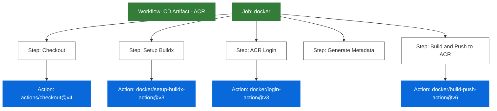

# Budowanie i Publikowanie Obrazów Docker do Azure Container Registry z GitHub Actions

## Wymagania

- Konto na GitHub
- Git zainstalowany lokalnie
- Konto w Azure z aktywną subskrypcją
- Wdrożona infrastruktura Azure z projektu `infra` (zawierająca Azure Container Registry)

## Cel

Celem jest zbudowanie pipeline'u w GitHub Actions, który automatycznie buduje i publikuje obrazy Docker do Azure Container Registry (ACR).

Pipeline powinien spełniać następujące wymagania:

- Uruchamiać się przy commitach do `main` - a więc po domknięciu Pull Requestu
- Budować obraz kontenera i tagować w oparciu o commit i datę merge'a
- Format tagu powinien zawierać pierwsze 8 znaków hasha commita oraz datę (yyyy-MM-dd)
- Przesyłać zbudowany obraz do Azure Container Registry

Zajrzyj do [dokumentacji GitHub Actions](https://docs.github.com/en/actions), aby dowiedzieć się więcej.

## Krok 0 - Fork repozytorium

Wykonaj fork tego repozytorium (przycisk "Fork" w prawym górnym rogu).

> Więcej o forkowaniu w [dokumentacji GitHub](https://docs.github.com/en/get-started/quickstart/fork-a-repo).

Sklonuj repozytorium na swój komputer lub cloud shell.


```bash
git clone https://github.com/your-username/basiccicd
cd basiccicd
```

## Krok 1 - Wdrożenie Infrastruktury Azure (ACR)

Przed konfiguracją pipeline musisz mieć wdrożoną infrastrukturę Azure z projektu `infra`, która zawiera Azure Container Registry.

1. Przejdź do katalogu `infra`:

```bash
cd infra
```

1. Jeśli jeszcze nie wdrożyłeś infrastruktury, postępuj zgodnie z instrukcjami w [README-infra.md](README-infra.md):

```bash
# Skopiuj przykładową konfigurację
cp terraform.tfvars.example terraform.tfvars

# Edytuj terraform.tfvars i uzupełnij wartości
nano terraform.tfvars

# Wdróż infrastrukturę
terraform init
terraform plan
terraform apply
```

1. Po wdrożeniu, pobierz nazwę ACR:

```bash
# Pobierz nazwę ACR z outputów Terraform
ACR_NAME=$(terraform output -raw acr_name)

# Wyświetl nazwę ACR
echo "ACR Name: $ACR_NAME"
```

1. Wróć do głównego katalogu projektu:

```bash
cd ..
```

## Krok 2 - Konfiguracja Uwierzytelniania GitHub z Azure

Skonfiguruj bezpieczne uwierzytelnianie GitHub Actions z Azure używając Managed Identity z OIDC:

1. Postępuj zgodnie z instrukcjami w [README-github-azure-auth-simple.md](README-github-azure-auth-simple.md)
2. Upewnij się, że Managed Identity ma przypisaną rolę `AcrPush` dla Twojego ACR (opisane w Kroku 3 dokumentu)
3. Dodaj wymagane sekrety w GitHub (opisane w Kroku 4 dokumentu):
   - `AZURE_CLIENT_ID`
   - `AZURE_TENANT_ID`
   - `AZURE_SUBSCRIPTION_ID`

## Krok 3 - Konfiguracja Zmiennych Środowiskowych GitHub

Dodaj zmienne środowiskowe dla ACR i nazwy obrazu:

1. Przejdź do swojego repozytorium na GitHub
2. Nawiguj do Settings > Secrets and variables > Actions
3. Przejdź do zakładki "Variables"
4. Dodaj następujące zmienne:
   - Name: `ACR_NAME`, Value: nazwa ACR bez `.azurecr.io` (np. "myprojectdevacr")
   - Name: `IMAGE_NAME`, Value: nazwa obrazu (np. "weather-app")

Te zmienne będą używane w workflow do określenia lokalizacji obrazu w ACR.

## Krok 4 - Tworzenie Workflow

Utwórz nowy branch:

```bash
git checkout -b artifacts-with-acr
```

Utwórz plik `.github/workflows/cd-acr.yml` i postępuj zgodnie z poniższymi krokami.  

Po każdym kroku wykonaj commit i push do repozytorium:

```bash
git add .
git commit -m "Add Docker workflow"
git push
```

### 4.1 Dodaj trigger

```yaml
name: Build and push to ACR

on:
  pull_request:
    branches: [ main ]
  push:
    branches: [ main ]
  workflow_dispatch:
```

### 4.2 Dodaj Job Budowania Docker

Utwórz job, który będzie:

- Pobierał kod
- Konfigurował Docker Buildx
- Logował się do Azure Container Registry

Sekcja poniżej odpowiada za logowanie się do ACR oraz uruchomienie buildu. Zauważ, że nie podajesz żadnej ścieżki do pliku.

```yaml
jobs:
  docker:
    name: Build and Push Image to ACR
    runs-on: ubuntu-latest
    
    permissions:
      id-token: write  # Wymagane dla OIDC
      contents: read
    
    steps:
      - name: Checkout code
        uses: actions/checkout@v4

      - name: Azure Login
        uses: azure/login@v2
        with:
          client-id: ${{ secrets.AZURE_CLIENT_ID }}
          tenant-id: ${{ secrets.AZURE_TENANT_ID }}
          subscription-id: ${{ secrets.AZURE_SUBSCRIPTION_ID }}

      - name: Set up Docker Buildx
        uses: docker/setup-buildx-action@v3

      - name: Login to Azure Container Registry
        run: |
          az acr login --name ${{ vars.ACR_NAME }}
```

Sekcja poniżej odpowiada za wygenerowanie taga, składającego się z fragmentu commit hasha i bieżącej daty.
  
```yaml
      - name: Generate image metadata
        id: meta
        run: |
          echo "DATE=$(date +'%Y-%m-%d')" >> $GITHUB_ENV
          echo "SHA=$(git rev-parse --short=8 HEAD)" >> $GITHUB_ENV

      - name: Build and push to ACR
        uses: docker/build-push-action@v6
        with:
          context: .
          push: true
          tags: ${{ vars.ACR_NAME }}.azurecr.io/${{ vars.IMAGE_NAME }}:${{ env.SHA }}-${{ env.DATE }}
```

**Wyjaśnienie:**

- `ACR_NAME` - nazwa rejestru ACR (np. `myprojectdevacr`), dodana jako GitHub Variable
- `IMAGE_NAME` - nazwa obrazu (np. `weather-app`), dodana jako GitHub Variable
- Tag: `{ACR_NAME}.azurecr.io/{IMAGE_NAME}:{SHA}-{DATE}` (np. `myprojectdevacr.azurecr.io/weather-app:a1b2c3d4-2026-01-03`)

> **💡 Bezpieczeństwo:** Ten workflow używa Managed Identity z OIDC zamiast haseł, co jest zgodne z najlepszymi praktykami Zero Trust.

## Krok 5 - Testowanie Workflow

1. Wykonaj commit i push:

```bash
git add .
git commit -m "Add ACR workflow"
git push origin artifacts-with-acr
```

2. Stwórz pull request i go zmerge'uj do `main`.
3. Przejdź do zakładki GitHub Actions, aby monitorować uruchomienie workflow
4. Po pomyślnym zakończeniu, sprawdź swój Azure Container Registry w poszukiwaniu nowego obrazu:

```bash
# Lista obrazów w ACR
az acr repository list --name $ACR_NAME -o table

# Lista tagów dla obrazu weather-app
az acr repository show-tags --name $ACR_NAME --repository weather-app -o table

# Lub sprawdź przez Azure Portal:
# Portal > Container registries > [twój ACR] > Repositories > weather-app
```

## Krok 6 - Weryfikacja Wymagań

Upewnij się, że Twój workflow:

- [x] Uruchamia się przy push do gałęzi main
- [x] Poprawnie buduje obraz Docker
- [x] Taguje obraz hashem commita i datą (format: `{8-char-hash}-{yyyy-MM-dd}`)
- [x] Przesyła obraz do Azure Container Registry

Twój pipeline jest teraz gotowy do automatycznego budowania i publikowania obrazów Docker do ACR!

## Krok 7 - Użycie Obrazu z ACR

Po zbudowaniu obrazu możesz go użyć w swoich deploymentach:

### Lokalne uruchomienie

```bash
# Zaloguj się do ACR
az acr login --name $ACR_NAME

# Pobierz obraz
docker pull ${ACR_LOGIN_SERVER}/weather-app:{TAG}

# Uruchom kontener
docker run -p 3000:3000 ${ACR_LOGIN_SERVER}/weather-app:{TAG}
```

### Deployment do Azure Web App

```bash
# Skonfiguruj Web App do użycia obrazu z ACR
az webapp config container set \
  --name <webapp-name> \
  --resource-group <resource-group> \
  --docker-custom-image-name ${ACR_LOGIN_SERVER}/weather-app:{TAG} \
  --docker-registry-server-url https://${ACR_LOGIN_SERVER} \
  --docker-registry-server-user $ACR_USERNAME \
  --docker-registry-server-password $ACR_PASSWORD
```

### Deployment do AKS

```bash
# AKS może automatycznie pobierać obrazy z ACR w tej samej subskrypcji
# Zaktualizuj deployment.yaml:
# image: {ACR_LOGIN_SERVER}/weather-app:{TAG}

kubectl apply -f deployment.yaml
```

## Struktura Workflow



## Najczęstsze Problemy

### 1. Błąd autoryzacji ACR

**Problem:** `unauthorized: authentication required`

**Rozwiązanie:**

```bash
# Sprawdź czy admin jest włączony w ACR
az acr update --name $ACR_NAME --admin-enabled true

# Pobierz nowe hasło
az acr credential show --name $ACR_NAME --query "passwords[0].value" -o tsv

# Zaktualizuj sekret ACR_PASSWORD w GitHub
```

### 2. Nieprawidłowy login server

**Problem:** `Error response from daemon: Get https://myacr.azurecr.io/v2/: unauthorized`

**Rozwiązanie:**

- Sprawdź czy `ACR_LOGIN_SERVER` zawiera pełny adres (np. `myproject-dev-acr.azurecr.io`)
- Nie dodawaj `https://` przed adresem

### 3. Quota przekroczona

**Problem:** `storage quota exceeded`

**Rozwiązanie:**

```bash
# Usuń stare obrazy
az acr repository delete --name $ACR_NAME --repository weather-app --tag {old-tag}

# Lub zwiększ SKU ACR (wymaga dodatkowych kosztów)
az acr update --name $ACR_NAME --sku Standard
```

## Dokumentacja

- [Azure Container Registry Documentation](https://learn.microsoft.com/en-us/azure/container-registry/)
- [GitHub Actions Documentation](https://docs.github.com/en/actions)
- [Docker Build Push Action](https://github.com/docker/build-push-action)
- [Azure CLI ACR Commands](https://learn.microsoft.com/en-us/cli/azure/acr)

## Powiązane README

- [README-infra.md](README-infra.md) - Wdrażanie infrastruktury Azure z ACR
- [README-deployment-webapp.md](README-deployment-webapp.md) - Deployment do Azure Web App
- [README-deployment-kubernetes.md](README-deployment-kubernetes.md) - Deployment do AKS

> Więcej szczegółów na temat struktury workflow GitHub Actions znajdziesz w [oficjalnej dokumentacji](https://docs.github.com/en/actions/learn-github-actions/understanding-github-actions)
