# GitOps z Argo CD na Azure Kubernetes Service

> **📋 Prerequisite:** Ten moduł wymaga ukończenia [README-deployment-kubernetes.md](README-deployment-kubernetes.md), który obejmuje wdrożenie infrastruktury Azure za pomocą Terraform. Wszystkie wymagane zasoby (AKS cluster, ACR, Key Vault) powinny już istnieć.

## Wymagania

- Konto Azure z aktywną subskrypcją
- **Ukończony moduł [README-deployment-kubernetes.md](README-deployment-kubernetes.md)** - który obejmuje:
  - Wdrożoną infrastrukturę Terraform z [README-infra.md](README-infra.md) (AKS cluster, ACR, Key Vault)
  - Skonfigurowane GitHub Actions secrets i variables
  - Działającą aplikację weather-app na Kubernetes
- Zainstalowane Azure CLI
- Zainstalowane kubectl
- Konto na GitHub

## Cel

Celem jest wdrożenie GitOps z wykorzystaniem Managed Argo CD dla AKS, który automatyzuje wdrożenia aplikacji i infrastruktury w oparciu o deklaratywny kod w repozytorium Git.

GitOps zapewnia:
- Deklaratywne zarządzanie konfiguracją klastra
- Git jako single source of truth
- Automatyczne synchronizowanie stanu klastra z repozytorium
- Audyt zmian i możliwość rollbacku
- Automatyczne wykrywanie driftu konfiguracji

W ramach tego modułu:
- Zainstalujemy Managed Argo CD jako rozszerzenie AKS
- Wdrożymy aplikację pogodową za pomocą Argo CD
- Zautomatyzujemy deployment Terraform w pipeline'ie
- Wdrożymy wzorce multi-environment z promocją między środowiskami

**Szacowany czas:** ~2 godziny

## Architektura GitOps

```text
┌─────────────────┐
│  Git Repository │  ◄── Developer Push
│  (Source of     │
│   Truth)        │
└────────┬────────┘
         │
         │ Pull/Watch
         ▼
┌─────────────────┐
│   Argo CD       │
│  (GitOps        │
│   Operator)     │
└────────┬────────┘
         │
         │ Apply
         ▼
┌─────────────────┐
│  Kubernetes     │
│  Cluster (AKS)  │
└─────────────────┘
```

---

## Część 0: USUŃ AUTOMATYCZNE WDROŻENIE NA KUBERNETES Z JOBA CD-ACR!

## Część 1: Instalacja Managed Argo CD (~45 minut)

### Krok 1.1 - Przygotowanie zmiennych środowiskowych

> **Uwaga:** Te zmienne powinny już być skonfigurowane z poprzedniego modułu. Infrastruktura AKS i ACR została utworzona przez Terraform z [README-infra.md](README-infra.md).

```bash
# Użyj wartości z Terraform outputs lub GitHub Variables
# Możesz pobrać wartości za pomocą:
cd infra
export RG_NAME=$(terraform output -raw resource_group_name)
export AKS_NAME=$(terraform output -raw aks_cluster_name)
export ACR_NAME=$(terraform output -raw acr_name)
export LOCATION=$(terraform output -raw location)
export SUBSCRIPTION_ID=$(az account show --query id -o tsv)

# Weryfikacja klastra (powinien być już dostępny z poprzedniego modułu)
az aks show --name $AKS_NAME --resource-group $RG_NAME --query "name"

# Sprawdź czy masz już credentials
kubectl get nodes
```

**PowerShell:**
```powershell
# Użyj wartości z Terraform outputs lub GitHub Variables
cd infra
$env:RG_NAME = terraform output -raw resource_group_name
$env:AKS_NAME = terraform output -raw aks_cluster_name
$env:ACR_NAME = terraform output -raw acr_name
$env:LOCATION = terraform output -raw location
$env:SUBSCRIPTION_ID = az account show --query id -o tsv

# Weryfikacja klastra
az aks show --name $env:AKS_NAME --resource-group $env:RG_NAME --query "name"

# Sprawdź czy masz już credentials
kubectl get nodes
```

### Krok 1.2 - Instalacja rozszerzeń Azure CLI

Zainstaluj rozszerzenia wymagane do zarządzania Argo CD:

```bash
# Dodaj rozszerzenia
az extension add --name k8s-configuration
az extension add --name k8s-extension

# Lub zaktualizuj jeśli już są zainstalowane
az extension update --name k8s-configuration
az extension update --name k8s-extension

# Sprawdź wersje
az extension list -o table | grep k8s
```

### Krok 1.3 - Rejestracja Resource Providers

> **Uwaga:** Jeśli infrastruktura została wdrożona przez Terraform, większość resource providers powinna być już zarejestrowana. Sprawdź status i zarejestruj tylko te, które są wymagane dla Argo CD.

```bash
# Sprawdź status resource providers
az provider show -n Microsoft.Kubernetes -o table
az provider show -n Microsoft.ContainerService -o table
az provider show -n Microsoft.KubernetesConfiguration -o table

# Zarejestruj tylko jeśli status nie jest "Registered"
az provider register --namespace Microsoft.Kubernetes
az provider register --namespace Microsoft.ContainerService
az provider register --namespace Microsoft.KubernetesConfiguration

# Monitoruj status rejestracji (może zająć do 10 minut)
az provider show -n Microsoft.KubernetesConfiguration -o table
```

Poczekaj aż `RegistrationState` będzie `Registered`.

### Krok 1.4 - Instalacja Argo CD jako rozszerzenia klastra

Zainstaluj Managed Argo CD na klastrze AKS:

```bash
# Instalacja w trybie single-node (dla środowisk dev/test)
az k8s-extension create \
  --resource-group $RG_NAME \
  --cluster-name $AKS_NAME \
  --cluster-type managedClusters \
  --name argocd \
  --extension-type Microsoft.ArgoCD \
  --release-train preview \
  --config deployWithHighAvailability=false \
  --config namespaceInstall=false \
  --config "config-maps.argocd-cmd-params-cm.data.application\.namespaces=default,argocd,weather-app"
```

> **Uwaga:** Dla środowisk produkcyjnych usuń parametr `--config deployWithHighAvailability=false` aby uruchomić w trybie HA (wymaga 3 węzłów).

**Parametry:**
- `deployWithHighAvailability=false` - instalacja na jednym węźle (domyślnie: HA z 3 węzłami)
- `namespaceInstall=false` - instalacja cluster-wide (możliwość zarządzania aplikacjami w wielu namespace'ach)
- `application.namespaces` - namespace'y, w których Argo CD może wykrywać definicje aplikacji

### Krok 1.5 - Weryfikacja instalacji

```bash
# Credentials do klastra powinny już być skonfigurowane z poprzedniego modułu
# Ale możesz je odświeżyć jeśli potrzeba:
az aks get-credentials --name $AKS_NAME --resource-group $RG_NAME --overwrite-existing

# Sprawdź czy pody Argo CD zostały uruchomione
kubectl get pods -n argocd

# Sprawdź rozszerzenie
az k8s-extension show \
  --resource-group $RG_NAME \
  --cluster-name $AKS_NAME \
  --cluster-type managedClusters \
  --name argocd
```

Oczekiwany output (pody w stanie `Running`):
```
NAME                                                READY   STATUS    RESTARTS   AGE
argocd-application-controller-0                     1/1     Running   0          2m
argocd-applicationset-controller-xxx                1/1     Running   0          2m
argocd-dex-server-xxx                               1/1     Running   0          2m
argocd-notifications-controller-xxx                 1/1     Running   0          2m
argocd-redis-xxx                                    1/1     Running   0          2m
argocd-repo-server-xxx                              1/1     Running   0          2m
argocd-server-xxx                                   1/1     Running   0          2m
```

### Krok 1.6 - Ekspozycja interfejsu Argo CD (tylko lokalnie!)


```bash
kubectl -n argocd port-forward svc/argocd-server 8081:80
```

### Krok 1.7 - Logowanie do Argo CD UI

Pobierz hasło administratora:

```bash
# Hasło jest przechowywane w Secret
kubectl -n argocd get secret argocd-initial-admin-secret -o jsonpath="{.data.password}" | base64 -d
echo ""
```

Zaloguj się do UI:
- URL: `http://localhost:8081`
- Username: `admin`
- Password: `<hasło z poprzedniego kroku>`

> **Best Practice:** Po pierwszym logowaniu zmień hasło administratora w UI (User Info > Update Password) lub użyj integracji z Azure AD (zaawansowane).

---

## Część 2: Wdrożenie Aplikacji przez GitOps (~45 minut)

### Krok 2.1 - Przygotowanie manifestów aplikacji w repozytorium

Aplikacja pogodowa posiada już manifesty w katalogu `infra/weather_app_manifests/`. Upewnij się, że kod jest w repozytorium Git:

```bash
# Sprawdź czy jesteś w repozytorium
git status

# Jeśli manifesty nie są w repo, dodaj je
git add infra/weather_app_manifests/
git commit -m "Add Kubernetes manifests for GitOps"
git push origin main
```

### Krok 2.2 - Utworzenie Argo CD Application

Utwórz plik `.github/argocd/weather-app.yaml` z definicją aplikacji:

```bash
apiVersion: argoproj.io/v1alpha1
kind: Application
metadata:
  name: weather-app-gitops
  namespace: argocd
  # Finalizer zapewnia cleanup przy usuwaniu aplikacji
  finalizers:
    - resources-finalizer.argocd.argoproj.io
spec:
  # Projekt (default dla basic setup)
  project: default
  
  # Źródło - repozytorium Git
  source:
    # UWAGA: Zmień na URL swojego forka!
    repoURL: https://github.com/TWOJ-USERNAME/basiccicd.git
    targetRevision: main #branch!
    path: infra/weather_app_manifests
    
    # Directory - deploy wszystkich YAML w katalogu
    directory:
      recurse: false
      include: '{namespace,deployment,service,ingress}.yaml'
  
  # Destination - gdzie wdrożyć
  destination:
    server: https://kubernetes.default.svc
    namespace: weather-app
  
  # Sync policy - automatyczna synchronizacja
  syncPolicy:
    automated:
      # Automatyczny deployment przy zmianach w Git
      prune: true        # Usuń zasoby nieobecne w Git
      selfHeal: true     # Cofnij manualne zmiany w klastrze
      allowEmpty: false  # Nie pozwól na pusty deployment
    
    syncOptions:
      - CreateNamespace=true  # Utwórz namespace jeśli nie istnieje
      - PruneLast=true        # Usuń zasoby na końcu (bezpieczniejsze)
    
    retry:
      limit: 5
      backoff:
        duration: 5s
        factor: 2
        maxDuration: 3m
```

**WAŻNE:** Zmień `repoURL` na URL swojego forka repozytorium!


### Krok 2.4 - Wdrożenie aplikacji przez Argo CD

```bash
# Zastosuj definicję Argo CD Application
kubectl apply -f .github/argocd/weather-app.yaml

# Sprawdź status aplikacji
kubectl get applications -n argocd

# Szczegóły aplikacji
kubectl describe application weather-app-gitops -n argocd
```

### Krok 2.5 - Monitorowanie wdrożenia w UI

1. Odśwież Argo CD UI (`<http://localhost:8081>`)
2. Zobaczysz aplikację `weather-app-gitops`
3. Kliknij na aplikację aby zobaczyć:
   - Topology view (wizualizacja zasobów)
   - Sync status (stan synchronizacji)
   - Health status (zdrowie aplikacji)
   - Last sync (ostatnia synchronizacja)

### Krok 2.6 - Weryfikacja wdrożenia

```bash
# Sprawdź pody
kubectl get pods -n weather-app

# Sprawdź serwis
kubectl get svc -n weather-app

# Sprawdź ingress
kubectl get ingress -n weather-app

# Pobierz External IP aplikacji
kubectl get ingress -n weather-app weather-app -o jsonpath='{.status.loadBalancer.ingress[0].ip}'
```

Przetestuj aplikację w przeglądarce: `http://<INGRESS-IP>`

### Krok 2.7 - Test automatycznej synchronizacji

Przetestujmy GitOps w akcji:

```bash
# Zmień liczbę replik w deployment
sed -i '' 's/replicas: 2/replicas: 3/' infra/weather_app_manifests/deployment.yaml

# Commit i push
git add infra/weather_app_manifests/deployment.yaml
git commit -m "Scale weather app to 3 replicas"
git push origin main
```

**PowerShell:**
```powershell
# Zmień liczbę replik w deployment
(Get-Content infra\weather_app_manifests\deployment.yaml) -replace 'replicas: 2', 'replicas: 3' | Set-Content infra\weather_app_manifests\deployment.yaml

# Commit i push
git add infra/weather_app_manifests/deployment.yaml
git commit -m "Scale weather app to 3 replicas"
git push origin main
```

W ciągu 3 minut (domyślny interwał sync) Argo CD:
1. Wykryje zmianę w Git
2. Automatycznie zsynchronizuje klaster
3. Wyskaluje aplikację do 3 replik

Sprawdź w UI lub CLI:

```bash
# Obserwuj zmiany w podach
kubectl get pods -n weather-app -w

# W Argo CD UI zobaczysz automatyczną synchronizację
```

### Krok 2.8 - Test Self-Healing

Sprawdźmy czy Argo CD cofa manualne zmiany:

```bash
# Zmień liczbę replik ręcznie przez kubectl
kubectl scale deployment weather-app -n weather-app --replicas=5

# Sprawdź pody
kubectl get pods -n weather-app
```

W ciągu 5 minut Argo CD wykryje drift i przywróci stan z Git (3 repliki).

### Krok 2.9 - Pełny Cykl GitOps: Od Zmiany Kodu do Wdrożenia

Przetestujmy kompletny przepływ GitOps, który łączy CI/CD pipeline z automatycznym wdrożeniem:

**Przepływ:**
1. Zmiana kodu aplikacji (zmiana tytułu strony)
2. Push do Git → GitHub Actions buduje nowy obraz w ACR
3. Aktualizacja manifestu Kubernetes z nowym tagiem obrazu
4. Argo CD automatycznie wykrywa zmianę i wdraża nową wersję

#### 2.9.1 Zmiana kodu aplikacji

```bash
# Utwórz nowy branch dla zmiany
git checkout -b feature/gitops-title

# Zmień tytuł w pliku index.html z "Weather App" na "Weather-App GitOps"
sed -i 's/<h1>Weather App<\/h1>/<h1>Weather-App GitOps<\/h1>/' public/index.html
sed -i 's/<title>Weather App<\/title>/<title>Weather-App GitOps<\/title>/' public/index.html

# Commit i push - to uruchomi workflow cd-kubernetes
git add public/index.html

cp public/styles-green.css public/styles.css

git add public/styles.css

git commit -m "Update app title to Weather-App GitOps and new colours"
git push origin feature/gitops-title
```

**PowerShell:**
```powershell
# Utwórz nowy branch dla zmiany
git checkout -b feature/gitops-title

# Zmień tytuł w pliku index.html z "Weather App" na "Weather-App GitOps"
(Get-Content public\index.html) -replace '<h1>Weather App</h1>', '<h1>Weather-App GitOps</h1>' -replace '<title>Weather App</title>', '<title>Weather-App GitOps</title>' | Set-Content public\index.html

# Commit i push - to uruchomi workflow cd-kubernetes
git add public/index.html

Copy-Item public\styles-green.css public\styles.css

git add public/styles.css

git commit -m "Update app title to Weather-App GitOps and new colours"
git push origin feature/gitops-title
```

#### 2.9.2 Monitorowanie budowania obrazu

1. Utwórz Pull Request w GitHub
2. Przejdź do Actions → workflow `Container image build and push to ACR`
4. Z logów joba skopiuj tag obrazu, np:
   ```
   tag=myregistry.azurecr.io/weather-app:abc12345-2026-01-06
   ```

Alternatywnie, możesz pobrać tag z ACR:
```bash
# Pobierz najnowszy tag z ACR
cd infra
export ACR_NAME=$(terraform output -raw acr_name)
cd ..

az acr repository show-tags --name $ACR_NAME --repository weather-app --orderby time_desc --top 1
```

**PowerShell:**
```powershell
# Pobierz najnowszy tag z ACR
cd infra
$env:ACR_NAME = terraform output -raw acr_name
cd ..

az acr repository show-tags --name $env:ACR_NAME --repository weather-app --orderby time_desc --top 1
```

#### 2.9.3 Aktualizacja manifestu dla Argo CD

Zaktualizuj manifest deploymentu z nowym obrazem:

```bash
# Upewnij się, że jesteś na swoim branchu feature
git checkout feature/gitops-title

# Otwórz plik deployment i zmień image tag
# Znajdź linię z "image:" i podmień na nowy tag
export NEW_IMAGE_TAG="<your-acr>.azurecr.io/weather-app:<commit-hash>-<date>"

# Użyj sed do aktualizacji
sed -i '' "s|image:.*|image: $NEW_IMAGE_TAG|g" infra/weather_app_manifests/deployment.yaml

# Lub ręcznie edytuj plik w edytorze
```

**PowerShell:**
```powershell
# Upewnij się, że jesteś na swoim branchu feature
git checkout feature/gitops-title

# Otwórz plik deployment i zmień image tag
$NEW_IMAGE_TAG = "<your-acr>.azurecr.io/weather-app:<commit-hash>-<date>"

# Użyj PowerShell do aktualizacji
(Get-Content infra\weather_app_manifests\deployment.yaml) -replace 'image:.*', "image: $NEW_IMAGE_TAG" | Set-Content infra\weather_app_manifests\deployment.yaml

# Lub ręcznie edytuj plik w edytorze
```

Sprawdź zmianę:
```bash
git diff infra/weather_app_manifests/deployment.yaml
```

#### 2.9.4 Push zmiany manifestu

```bash
# Commit aktualizacji manifestu
git add infra/weather_app_manifests/deployment.yaml
git commit -m "Update image tag to GitOps version: $NEW_IMAGE_TAG"
git push origin feature/gitops-title

```

#### 2.9.5 Obserwowanie automatycznego wdrożenia przez Argo CD

Argo CD automatycznie wykryje zmianę w ciągu ~3 minut:

```bash
# Obserwuj status synchronizacji
kubectl get applications -n argocd -w

# Obserwuj pody - zobaczysz rolling update
kubectl get pods -n weather-app -w

# Sprawdź w Argo CD UI
echo "Argo CD UI: http://localhost:8081"
```

W Argo CD UI zobaczysz:
- **Out of Sync** → **Syncing** → **Synced**
- Nowe pody z zaktualizowanym tytułem są wdrażane
- Stare pody są stopniowo usuwane (rolling update)

#### 2.9.6 Weryfikacja nowej wersji

```bash
# Pobierz adres Ingress
kubectl get ingress -n weather-app weather-app-ingress -o jsonpath='{.status.loadBalancer.ingress[0].ip}'

# Otwórz w przeglądarce - zobaczysz nowy tytuł "Weather-App GitOps"!
```

#### 2.9.7 Automatyzacja: Image Updater (Opcjonalnie)

Dla pełnej automatyzacji możesz użyć **Argo CD Image Updater**, który automatycznie aktualizuje manifesty gdy nowy obraz pojawi się w ACR:

```bash
# Zainstaluj Argo CD Image Updater
kubectl apply -n argocd -f https://raw.githubusercontent.com/argoproj-labs/argocd-image-updater/stable/manifests/install.yaml

# Dodaj adnotację do Application
kubectl annotate application weather-app-gitops -n argocd \
  argocd-image-updater.argoproj.io/image-list="weather-app=$ACR_NAME.azurecr.io/weather-app" \
  argocd-image-updater.argoproj.io/weather-app.update-strategy=latest
```

Z Image Updater:
- Push kodu → CI buduje obraz → Image Updater wykrywa nowy tag → Automatycznie updatuje manifest → Argo CD wdraża
- **Zero ręcznej interwencji!**

**Podsumowanie przepływu GitOps:**

```mermaid
graph LR
    A[Zmiana kodu] --> B[git push]
    B --> C[GitHub Actions CI]
    C --> D[Build & Push do ACR]
    D --> E[Update manifest]
    E --> F[git push manifest]
    F --> G[Argo CD wykrywa zmianę]
    G --> H[Automatyczne wdrożenie]
    H --> I[Nowa wersja live!]
    
    style A fill:#f9f,stroke:#333
    style D fill:#347d39,color:#fff
    style G fill:#ff9900,color:#fff
    style I fill:#0969da,color:#fff
```



---

## Część 3: Advanced GitOps Patterns (~30 minut)

### Krok 3.1 - Multi-Environment z Argo CD Projects

Załóż nowy branch:

```bash
git checkout -b "feat/gitops-multienvs"
```

Utwórz strukturę dla wielu środowisk:

```bash
mkdir -p .github/argocd/environments/{dev,staging,prod}
```

**PowerShell:**
```powershell
New-Item -ItemType Directory -Force -Path .github\argocd\environments\dev
New-Item -ItemType Directory -Force -Path .github\argocd\environments\staging
New-Item -ItemType Directory -Force -Path .github\argocd\environments\prod
```

Utwórz Argo CD Projects dla separacji środowisk `.github/argocd/projects.yaml`:

```yaml
apiVersion: argoproj.io/v1alpha1
kind: AppProject
metadata:
  name: dev
  namespace: argocd
spec:
  description: Development Environment
  sourceRepos:
    - '*'
  destinations:
    - namespace: 'weather-app-dev'
      server: https://kubernetes.default.svc
  clusterResourceWhitelist:
    - group: ''
      kind: Namespace
  namespaceResourceWhitelist:
    - group: '*'
      kind: '*'
---
apiVersion: argoproj.io/v1alpha1
kind: AppProject
metadata:
  name: staging
  namespace: argocd
spec:
  description: Staging Environment
  sourceRepos:
    - '*'
  destinations:
    - namespace: 'weather-app-staging'
      server: https://kubernetes.default.svc
  clusterResourceWhitelist:
    - group: ''
      kind: Namespace
  namespaceResourceWhitelist:
    - group: '*'
      kind: '*'
---
apiVersion: argoproj.io/v1alpha1
kind: AppProject
metadata:
  name: prod
  namespace: argocd
spec:
  description: Production Environment
  sourceRepos:
    - '*'
  destinations:
    - namespace: 'weather-app-prod'
      server: https://kubernetes.default.svc
  clusterResourceWhitelist:
    - group: ''
      kind: Namespace
  namespaceResourceWhitelist:
    - group: '*'
      kind: '*'
  syncWindows:
    - kind: allow
      schedule: '0 9-17 * * 1-7'  # Tylko w godzinach pracy, pon-ndz
      duration: 8h
      applications:
        - '*'
```

Zastosuj projekty:

```bash
kubectl apply -f .github/argocd/projects.yaml
```

### Krok 3.2 - Environment-specific Applications

Utwórz aplikacje dla każdego środowiska z różnymi konfiguracjami:

**UWAGA:** Zmień `repoURL` na swój fork!

```yaml
# .github/argocd/environments/dev/weather-app.yaml
apiVersion: argoproj.io/v1alpha1
kind: Application
metadata:
  name: weather-app-dev
  namespace: argocd
spec:
  project: dev
  source:
    repoURL: https://github.com/TWOJ-USERNAME/basiccicd.git
    targetRevision: main
    path: infra/weather_app_manifests
    directory:
      recurse: false
      include: '{namespace,deployment,service,ingress}.yaml'
  destination:
    server: https://kubernetes.default.svc
    namespace: weather-app-dev
  syncPolicy:
    automated:
      prune: true
      selfHeal: true
    syncOptions:
      - CreateNamespace=true
```

```yaml
# .github/argocd/environments/staging/weather-app.yaml
apiVersion: argoproj.io/v1alpha1
kind: Application
metadata:
  name: weather-app-staging
  namespace: argocd
spec:
  project: staging
  source:
    repoURL: https://github.com/TWOJ-USERNAME/basiccicd.git
    targetRevision: release/staging
    path: infra/weather_app_manifests
    directory:
      recurse: false
      include: '{namespace,deployment,service,ingress}.yaml'
  destination:
    server: https://kubernetes.default.svc
    namespace: weather-app-staging
  syncPolicy:
    automated:
      prune: true
      selfHeal: true
    syncOptions:
      - CreateNamespace=true
```

```yaml
# PROD - manualna synchronizacja, tylko w sync windows
# .github/argocd/environments/prod/weather-app.yaml
apiVersion: argoproj.io/v1alpha1
kind: Application
metadata:
  name: weather-app-prod
  namespace: argocd
spec:
  project: prod
  source:
    repoURL: https://github.com/TWOJ-USERNAME/basiccicd.git
    targetRevision: release/v1.0
    path: infra/weather_app_manifests
    directory:
      recurse: false
      include: '{namespace,deployment,service,ingress}.yaml'
  destination:
    server: https://kubernetes.default.svc
    namespace: weather-app-prod
  syncPolicy:
    # BRAK automated - wymagana manualna synchronizacja w UI
    syncOptions:
      - CreateNamespace=true
```

```bash
git commit -am "GitOps - wiele środowisk"
git push
```

Stwórz Pull Request i zmerge'uj.

### Krok 3.3 - Environment Promotion Strategy

Utwórz branch strategy dla promocji:

```bash
git pull
# DEV - ciągłe deployment z main
# main branch -> weather-app-dev

# STAGING - deployment z release branch
git checkout -b release/staging
git push origin release/staging

# PROD - deployment z tagów
git tag -a release/v1.0 -m "Production release v1.0"
git push origin release/v1.0
```

Zastosuj aplikacje:

```bash
kubectl apply -f .github/argocd/environments/dev/weather-app.yaml
kubectl apply -f .github/argocd/environments/staging/weather-app.yaml
kubectl apply -f .github/argocd/environments/prod/weather-app.yaml
```

### Krok 3.4 - Integracja z Private ACR (Opcjonalnie)

> **Uwaga:** Azure Container Registry został już utworzony przez Terraform i podłączony do klastra AKS w poprzednim module. Ten krok jest opcjonalny jeśli chcesz dodatkowo skonfigurować workload identity dla Argo CD.

Jeśli używasz prywatnego ACR i chcesz skonfigurować dodatkową workload identity:

```bash
# ACR został już utworzony przez Terraform, pobierz jego nazwę
cd infra
export ACR_NAME=$(terraform output -raw acr_name)
cd ..

# Utwórz managed identity dla Argo CD
az identity create \
  --name argocd-acr-identity \
  --resource-group $RG_NAME

# Pobierz client ID
export IDENTITY_CLIENT_ID=$(az identity show \
  --name argocd-acr-identity \
  --resource-group $RG_NAME \
  --query clientId -o tsv)

# Przypisz rolę AcrPull
export ACR_ID=$(az acr show --name $ACR_NAME --resource-group $RG_NAME --query id -o tsv)
az role assignment create \
  --assignee $IDENTITY_CLIENT_ID \
  --role AcrPull \
  --scope $ACR_ID

# Zaktualizuj Argo CD extension z workload identity
az k8s-extension update \
  --resource-group $RG_NAME \
  --cluster-name $AKS_NAME \
  --cluster-type managedClusters \
  --name argocd \
  --config "workloadIdentity.enable=true" \
  --config "workloadIdentity.clientId=$IDENTITY_CLIENT_ID"
```

**PowerShell:**
```powershell
# ACR został już utworzony przez Terraform, pobierz jego nazwę
cd infra
$env:ACR_NAME = terraform output -raw acr_name
cd ..

# Utwórz managed identity dla Argo CD
az identity create `
  --name argocd-acr-identity `
  --resource-group $env:RG_NAME

# Pobierz client ID
$env:IDENTITY_CLIENT_ID = az identity show `
  --name argocd-acr-identity `
  --resource-group $env:RG_NAME `
  --query clientId -o tsv

# Przypisz rolę AcrPull
$env:ACR_ID = az acr show --name $env:ACR_NAME --resource-group $env:RG_NAME --query id -o tsv
az role assignment create `
  --assignee $env:IDENTITY_CLIENT_ID `
  --role AcrPull `
  --scope $env:ACR_ID

# Zaktualizuj Argo CD extension z workload identity
az k8s-extension update `
  --resource-group $env:RG_NAME `
  --cluster-name $env:AKS_NAME `
  --cluster-type managedClusters `
  --name argocd `
  --config "workloadIdentity.enable=true" `
  --config "workloadIdentity.clientId=$env:IDENTITY_CLIENT_ID"
```

### Krok 3.5 - Automated Rollback Configuration

Skonfiguruj automatyczny rollback w przypadku nieudanego wdrożenia:

```bash
cat <<'EOF' > .github/argocd/rollback-hook.yaml
apiVersion: argoproj.io/v1alpha1
kind: Application
metadata:
  name: weather-app-prod-with-rollback
  namespace: argocd
spec:
  project: prod
  source:
    repoURL: https://github.com/TWOJ-USERNAME/basiccicd.git
    targetRevision: release/v1.0
    path: infra/weather_app_overlays/prod
  destination:
    server: https://kubernetes.default.svc
    namespace: weather-app-prod
  syncPolicy:
    syncOptions:
      - CreateNamespace=true
    retry:
      limit: 3
      backoff:
        duration: 5s
        factor: 2
        maxDuration: 1m
  # Health assessment
  ignoreDifferences:
    - group: apps
      kind: Deployment
      jsonPointers:
        - /spec/replicas
  # Rollback on failure
  revisionHistoryLimit: 5
EOF
```

### Krok 3.6 - Monitoring i Notifications

Skonfiguruj notyfikacje Slack/Teams dla Argo CD (opcjonalnie):

```bash
# Konfiguracja w argocd-notifications-cm ConfigMap
kubectl patch configmap argocd-notifications-cm -n argocd --type merge -p '{
  "data": {
    "service.webhook.generic": "url: https://your-webhook-url",
    "trigger.on-deployed": "- when: app.status.operationState.phase in [Succeeded] && app.status.health.status == Healthy\n  send: [app-deployed]",
    "template.app-deployed": "message: Application {{.app.metadata.name}} deployed successfully"
  }
}'
```

---

## Weryfikacja i Best Practices

### Weryfikacja końcowa

Sprawdź czy wszystkie komponenty działają:

```bash
# 1. Argo CD działa
kubectl get pods -n argocd

# 2. Aplikacje są zsynchronizowane
kubectl get applications -n argocd

# 3. Multi-environment deployments
kubectl get namespaces | grep weather-app

# 4. Weryfikacja infrastruktury Terraform (opcjonalnie)
# Jeśli chcesz sprawdzić stan infrastruktury utworzonej przez Terraform:
cd infra
terraform output
terraform show
cd ..
```

### GitOps Best Practices

**1. Single Source of Truth**
- Wszystkie zmiany tylko przez Git
- Nigdy nie używaj `kubectl apply` ręcznie
- Dokumentuj zmiany w commit messages

**2. Security**
- Używaj Sealed Secrets dla wrażliwych danych
- Implementuj RBAC w Argo CD Projects
- Regularnie audituj dostępy

**3. Environment Management**
- DEV: automatyczna sync z `main`
- STAGING: automatyczna sync z `release/*` branches
- PROD: manualna sync z tagów (v1.0, v2.0)

**4. Rollback Strategy**
- Utrzymuj revision history (min 5 wersji)
- Testuj rollback regularnie
- Dokumentuj procedury rollback

**5. Monitoring**
- Konfiguruj alerty dla failed syncs
- Śledź metrics w Argo CD UI

### Troubleshooting

**Problem: Application nie synchronizuje się**
```bash
# Sprawdź logi
kubectl logs -n argocd deployment/argocd-repo-server
kubectl logs -n argocd deployment/argocd-application-controller

# Force sync
kubectl patch application weather-app-gitops -n argocd \
  --type merge -p '{"operation":{"initiatedBy":{"username":"admin"},"sync":{"revision":"HEAD"}}}'
```

**Problem: Terraform state lock**
```bash
# Usuń lock (ostrożnie!)
terraform force-unlock <LOCK_ID>
```

---

## Podsumowanie

Gratulacje! Wdrożyłeś kompletne rozwiązanie GitOps z:

✅ Managed Argo CD na AKS  
✅ Automatycznym deploymentem aplikacji z Git  
✅ Self-healing i auto-sync  
✅ Terraform automation w pipeline  
✅ Multi-environment setup (dev/staging/prod)  
✅ Environment promotion strategy  
✅ Automated rollback  

### Następne kroki

1. **Zaawansowane deployment strategies**: Wdróż [README-deployment-kubernetes.md](README-deployment-kubernetes.md) z automatycznym Blue/Green i Canary używając Flagger
2. **Observability**: Dodaj monitoring z [README-observability.md](README-observability.md) (Prometheus + Grafana)
3. **Security**: Zaimplementuj Sealed Secrets i Policy as Code (OPA)
4. **Multi-cluster**: Rozszerz Argo CD na wiele klastrów AKS

### Materiały dodatkowe

- [Argo CD Documentation](https://argo-cd.readthedocs.io/)
- [Azure GitOps with Argo CD](https://learn.microsoft.com/en-us/azure/azure-arc/kubernetes/tutorial-use-gitops-argocd)
- [Kustomize Documentation](https://kustomize.io/)
- [GitOps Principles](https://opengitops.dev/)

---

**Szacowany czas realizacji:** ~2 godziny  
**Poziom:** Średniozaawansowany do zaawansowanego
