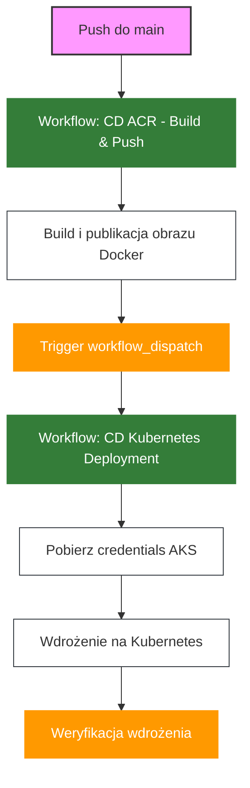

# Wdrażanie Aplikacji na Kubernetes z GitHub Actions

## Wymagania

- Konto na GitHub
- Konto Azure z aktywną subskrypcją
- Git zainstalowany lokalnie
- Azure CLI (opcjonalnie)

## Cel

Celem jest zbudowanie kompletnego pipeline'u CI/CD w GitHub Actions, który:
- Buduje aplikację NodeJS
- Tworzy obraz Docker
- Publikuje obraz w Azure Container Registry
- Wdraża aplikację na klaster Kubernetes w Azure

> **💡 Dla zaawansowanych:** Po ukończeniu tego modułu możesz rozszerzyć deployment o GitOps z Argo CD. Zobacz [README-gitops.md](README-gitops.md) aby wdrożyć automatyczne synchronizacje z Git, multi-environment management i zaawansowane wzorce wdrożeń.

## Krok 0 - Przygotowanie Infrastruktury

1. Postępuj zgodnie z instrukcją w dokumencie [README-infra.md](README-infra.md), aby utworzyć wymaganą infrastrukturę w Azure, w tym klaster AKS i Azure Container Registry.

2. Po utworzeniu infrastruktury, sprawdź połączenie z klastrem Kubernetes:

```bash
RG_NAME=<nazwa-resource-group>
AKS_NAME=<nazwa-clustra>

az aks get-credentials --name $AKS_NAME --resource-group $RG_NAME

kubectl get nodes
```

## Krok 1 - Połącz GitHub ze swoją subskrypcją i nadaj odpowiednie role

### 1.1 Identity

Wykonaj kroki z [README-github-azure-auth-simple](./README-github-azure-auth-simple.md).

### 1.2 Zmienne GitHub

1. Przejdź do swojego repozytorium na GitHub
2. Nawiguj do Settings > Secrets and variables > Actions
3. Przejdź do zakładki "Variables"
4. Dodaj następujące zmienne:
   - `ACR_NAME`: Nazwa rejestru kontenerów (bez .azurecr.io)
   - `AZURE_CLUSTER_NAME`: Nazwa klastra AKS
   - `AZURE_RESOURCE_GROUP`: Nazwa grupy zasobów

> **💡 Uwaga:** Workflow używa Managed Identity z OIDC (skonfigurowanej w kroku 1.1) zamiast haseł, co jest zgodne z najlepszymi praktykami Zero Trust.

## Krok 2 - Konfiguracja ACR i wdrożenie zasobów Kubernetes

### 2.1 Podłącz ACR do klastra Kubernetes

Umożliwi to klastrowi AKS pobieranie obrazów z Azure Container Registry bez dodatkowej autoryzacji:

```bash
# Ustaw zmienne środowiskowe
export RG_NAME="<nazwa-resource-group>"
export AKS_NAME="<nazwa-klastra>"
export ACR_NAME="<nazwa-acr>"

# Podłącz ACR do AKS
az aks update --name $AKS_NAME --resource-group $RG_NAME --attach-acr $ACR_NAME
```

### 2.2 Wdróż zasoby Kubernetes

```bash
# Zamień REPLACEME na wartość ACR_NAME we wszystkich manifestach
sed -i "s/REPLACEME/$ACR_NAME/g" infra/weather_app_manifests/*.yaml
```

Zamiast aplikować każdy manifest osobno, użyj pojedynczej komendy dla całego katalogu:

```bash
# Wdróż wszystkie manifesty jedną komendą
kubectl apply -f infra/weather_app_manifests/
```

> **Wskazówka:** Komenda `kubectl apply -f <katalog>/` automatycznie aplikuje wszystkie pliki YAML w katalogu. Jest to prostsze i szybsze niż wykonywanie osobnych komend dla każdego pliku.

Weryfikacja wdrożenia:

```bash
# Sprawdź czy wszystkie zasoby zostały utworzone
kubectl get all -n weather-app
```

## Krok 3 - Konfiguracja Wyzwalacza Między Przepływami

Utwórz nowy branch:

```bash
git checkout -b k8s-deployment
```

### 3.1 Konfiguracja Personal Access Token (PAT)

Aby umożliwić automatyczne wyzwalanie workflow deployment, musisz utworzyć Personal Access Token:

1. Przejdź do GitHub > Settings (twoje konto, nie repozytorium) > Developer settings > Personal access tokens > Tokens (classic)
2. Kliknij "Generate new token" > "Generate new token (classic)"
3. Nadaj tokenowi nazwę, np. "Workflow Trigger Token"
4. Ustaw expiration (np. 90 dni)
5. Zaznacz scope: **`repo`** oraz **`workflow`**
6. Kliknij "Generate token" i skopiuj token
7. W swoim repozytorium przejdź do Settings > Secrets and variables > Actions > Secrets
8. Dodaj nowy secret o nazwie `PAT_TOKEN` i wklej skopiowany token

### 3.2 Modyfikacja cd-acr.yml

Zmodyfikuj plik `.github/workflows/cd-acr.yml`, aby dodać wyzwalacz dla przepływu wdrażania na Kubernetes po pomyślnym zbudowaniu obrazu Docker w ACR:

```yaml   
      - name: Trigger Kubernetes deployment workflow
        if: success() && github.ref == 'refs/heads/main' && github.event_name == 'push'
        uses: actions/github-script@v6
        with:
          github-token: ${{ secrets.PAT_TOKEN }}
          script: |
            await github.rest.actions.createWorkflowDispatch({
              owner: context.repo.owner,
              repo: context.repo.repo,
              workflow_id: 'cd-kubernetes.yml',
              ref: 'main',
              inputs: {
                image_tag: '${{ env.SHA }}-${{ env.DATE }}'
              }
            })
```

> **💡 Uwaga:** Używamy `PAT_TOKEN` zamiast domyślnego `GITHUB_TOKEN`, ponieważ tylko Personal Access Token ma uprawnienia do wyzwalania innych workflow.

### 3.3 Tworzenie Workflow Deployment

Utwórz plik `.github/workflows/cd-kubernetes.yml` z poniższą zawartością:

```yaml
name: CD Kubernetes Deployment

on:
  workflow_dispatch:
    inputs:
      image_tag:
        description: 'Tag obrazu Docker do wdrożenia'
        required: true

env:
  APP_NAME: weather-app
  REGISTRY_NAME: ${{ vars.ACR_NAME }}
  CLUSTER_NAME: ${{ vars.AZURE_CLUSTER_NAME }}
  RESOURCE_GROUP: ${{ vars.AZURE_RESOURCE_GROUP }}

permissions:
  id-token: write
  contents: read

jobs:
  deploy-to-kubernetes:
    name: Deploy to Kubernetes
    runs-on: ubuntu-latest
    
    permissions:
      id-token: write
      contents: read
    
    steps:
      - name: Checkout code
        uses: actions/checkout@v4
        
      - name: Set image tag from input
        id: image-tag
        run: echo "IMAGE_TAG=${{ github.event.inputs.image_tag }}" >> $GITHUB_OUTPUT
        
      - name: Login to Azure
        uses: azure/login@v2
        with:
          client-id: ${{ secrets.AZURE_CLIENT_ID }}
          tenant-id: ${{ secrets.AZURE_TENANT_ID }}
          subscription-id: ${{ secrets.AZURE_SUBSCRIPTION_ID }}
          
      - name: Get AKS credentials
        uses: azure/aks-set-context@v3
        with:
          resource-group: ${{ env.RESOURCE_GROUP }}
          cluster-name: ${{ env.CLUSTER_NAME }}
      
      - name: Setup kubectl
        uses: azure/setup-kubectl@v4
          
      - name: Deploy to Kubernetes
        uses: Azure/k8s-deploy@v5
        with:
          action: deploy
          namespace: weather-app
          manifests: |
            infra/weather_app_manifests/deployment.yaml
          images: |
            ${{ vars.ACR_NAME }}.azurecr.io/${{ env.APP_NAME }}:${{ steps.image-tag.outputs.IMAGE_TAG }}
          pull-images: false
          
      - name: Verify deployment
        run: |
          kubectl get pods,svc,ingress -n weather-app
```

> **💡 Uwaga:** Ten workflow jest uruchamiany automatycznie przez workflow budowania obrazu (`cd-acr.yml`). Możesz również uruchomić go ręcznie z zakładki Actions, podając tag obrazu do wdrożenia.

### 3.4 Commit i Push Workflow

```bash
git add .github/workflows/cd-kubernetes.yml
git commit -m "Add Kubernetes deployment workflow with automated trigger"
git push --set-upstream origin k8s-deployment
```

## Krok 4 - Testowanie Flow Wdrażania

1. Utwórz Pull Request i przeprowadź merge do main
2. Przepływ `cd-acr.yml` powinien się uruchomić, zbudować i opublikować obraz Docker w ACR
3. Po pomyślnym zakończeniu, automatycznie powinien uruchomić się przepływ `cd-kubernetes.yml`
4. Obserwuj oba przepływy w zakładce Actions na GitHub
5. Po zakończeniu wdrożenia, sprawdź status zasobów w klastrze Kubernetes:

```bash
kubectl get pods,svc,ing -n weather-app
```

W wynikach znajdziesz m.in adres IP, otwórz stronę i zobacz czy widzisz Weather App.

## Krok 5 - Blue/Green Deployment (Opcjonalne)

- stwórz nowy branch `k8s-blue-green`

- Pobierz obraz blue
  
  Pobierz nazwę obrazu z pipeline, ACR lub przez podejrzenie definicji deploymentu:  

  ```bash
  kubectl get deployment -n weather-app -o=jsonpath='{.items[0].spec.template.spec.containers[0].image}'
  ```

- Podmień definicję kolorów 

  ```bash
  # W katalogu projektu
  cp public/styles-green.css public/styles.css
  
  git add public/styles.css
  
  git commit -m "Aktualizacja stylu na wersję Green"
  
  git push
  ```

- Stwórz pull request. Zauważ, że zmiana spowoduje automatyczne wdrożenie na środowisko - przerwij flow zaraz po zbudowaniu obrazu
- Pobierz nazwę obrazu green - poznasz ją po commit hash

## Krok 6 - Wdrożenie Blue/Green Deployments
  
W plikach `infra/weather_app_manifests_blue/deployment-blue.yaml` i `infra/weather_app_manifests_green/deployment-green.yaml` zmień nazwy obrazów na właściwe (użyj tagów z poprzednich kroków).

Wdróż zasoby kubernetes:

```bash
kubectl apply -f infra/weather_app_manifests_blue/
kubectl apply -f infra/weather_app_manifests_green/
```

Zweryfikuj czy aplikacja jest wdrożona:

```bash
kubectl get pods -n weather-app -l version=blue

kubectl get pods -n weather-app -l version=green
```

_- zweryfikuj `<IP>/green` czy widzisz aplikację we właściwej wersji i czy działa - krok nie działa!_

- Lub zrób port forward (tylko lokalna maszyna):

```bash
kubectl -n weather-app port-forward svc/weather-app-green-test 8080:80
```

## Krok 7 - Wskaż na green deployment

- przełącz wskazanie na service

```bash
kubectl patch service weather-app-blue-green -n weather-app -p '{"spec":{"selector":{"version":"green"}}}'
```

- zeskaluj pody blue

```bash
kubectl -n weather-app scale deployment weather-app-blue --replicas=0
```

## Krok 8 - Zasymuluj canary deployment

zeskaluj do zera oryginalny deployment i usun ingress:

```bash
kubectl -n weather-app scale deployment weather-app --replicas=0

kubectl delete -f infra/weather_app_manifests_green/ingress-blue-green.yaml
kubectl delete -f infra/weather_app_manifests_green/ingress-green-test.yaml
```

Przełącz service, aby wskazywał na oba wdrożenia (blue i green):

```bash
# Zaktualizuj selector service, aby wskazywał na app=weather-app (bez wersji)
kubectl patch service weather-app-blue-green -n weather-app -p '{"spec":{"selector":{"app":"weather-app"}}}'
```

Zeskaluj liczbę podów - green do 1 (20% ruchu), blue do 4 (80% ruchu):

```bash
# Zeskaluj green deployment do 1 repliki (canary)
kubectl -n weather-app scale deployment weather-app-green --replicas=1

# Zeskaluj blue deployment do 4 replik (stable)
kubectl -n weather-app scale deployment weather-app-blue --replicas=4
```

Sprawdź dystrybucję podów:

```bash
kubectl get pods -n weather-app -l app=weather-app --show-labels
```

Dzięki temu service będzie routował ~20% ruchu do green (1 pod) i ~80% do blue (4 pody).

Odśwież kilkukrotnie stronę.

## Szczegóły Implementacji

Pipeline CI/CD składa się z dwóch oddzielnych workflow:

1. **cd-acr.yml** (Build i Publikacja):
   - Buduje aplikację NodeJS
   - Uruchamia testy
   - Buduje obraz Docker
   - Taguje go z użyciem 8-znakowego hasha commita i daty (YYYY-MM-DD)
   - Publikuje obraz w Azure Container Registry
   - Wyzwala workflow wdrożenia na Kubernetes

2. **cd-kubernetes.yml** (Deployment):
   - Przyjmuje tag obrazu jako parametr wejściowy
   - Loguje się do Azure i uzyskuje dostęp do klastra AKS
   - Wdraża aplikację na Kubernetes używając określonego obrazu
   - Weryfikuje status wdrożenia

### Zaawansowane Funkcje

1. **Zarządzanie sekretami**:
   - Klucz API jest przechowywany jako sekret Kubernetes
   - Service Principal jest przechowywany w GitHub Secrets

2. **Optymalizacja buildów**:
   - Wykorzystanie Docker Buildx i cache'owania w GitHub Actions
   - Przekazywanie tylko niezbędnych plików jako artefaktów

3. **Zarządzanie zasobami Kubernetes**:
   - Ustawienie limitów zasobów dla kontenerów
   - Konfiguracja readiness i liveness probes
   - Użycie replicas dla wysokiej dostępności

4. **Obsługa błędów**:
   - Weryfikacja statusu wdrożenia z timeoutem
   - Idempotentne tworzenie namespaces i sekretów

## Kompletny Diagram Przepływu CI/CD



## Najczęstsze Problemy

1. **Problem z poświadczeniami**: Upewnij się, że Service Principal ma odpowiednie uprawnienia do ACR i AKS.
2. **Błędy budowania**: Sprawdź logi w GitHub Actions, aby zobaczyć szczegóły błędów.
3. **Problemy z Ingress**: Sprawdź, czy kontroler Ingress jest poprawnie zainstalowany w klastrze.
4. **Timeout podczas wdrożenia**: Może być spowodowany problemami z zasobami klastra lub błędami w konfiguracji.

## Weryfikacja Wdrożenia

Po zakończeniu wdrożenia możesz zweryfikować działanie aplikacji:

1. Znajdź adres Ingress:
```bash
kubectl get ingress weather-app-ingress -n weather-app
```

2. Otwórz przeglądarkę i przejdź pod adres podany w kolumnie ADDRESS
3. Możesz również sprawdzić logi aplikacji:
```bash
kubectl logs -l app=weather-app -n weather-app
```

## Następne Kroki

### Automatyzacja z GitOps (Zaawansowane)

W tym module używaliśmy `kubectl apply` w GitHub Actions do wdrażania aplikacji. Alternatywnym, bardziej zaawansowanym podejściem jest **GitOps z Argo CD**, które oferuje:

**Deklaratywne zarządzanie** - Git jako single source of truth  
**Automatyczna synchronizacja** - Argo CD wykrywa zmiany w repo i automatycznie aktualizuje klaster  
**Self-healing** - Automatyczne cofanie ręcznych zmian w klastrze  
**Multi-environment** - Łatwe zarządzanie dev/staging/prod  
**Drift detection** - Wykrywanie różnic między Git a klastrem  
**Rollback** - Łatwy powrót do poprzednich wersji

Aby wdrożyć GitOps, zobacz **[README-gitops.md](README-gitops.md)** (~2h, poziom średnio-zaawansowany).

## Dokumentacja

- [GitHub Actions](https://docs.github.com/en/actions)
- [Azure Kubernetes Service](https://docs.microsoft.com/en-us/azure/aks/)
- [Kubernetes Documentation](https://kubernetes.io/docs/home/)
- [Docker Buildx](https://docs.docker.com/engine/reference/commandline/buildx/)
- [GitOps with Argo CD](https://argo-cd.readthedocs.io/) - dla zaawansowanych
