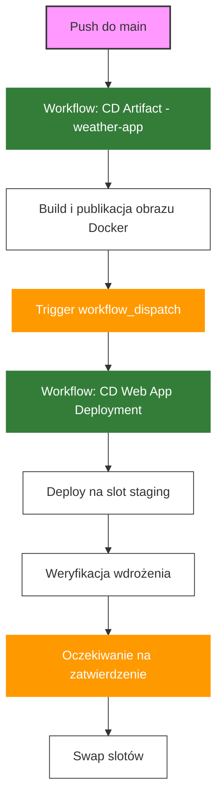

# Wdrażanie Aplikacji Kontenerowej na Azure Web App z GitHub Actions

## Wymagania

- Konto na GitHub
- Konto Azure z aktywną subskrypcją
- Git zainstalowany lokalnie
- Azure CLI
- Wdrożona infrastruktura Azure z ACR (zgodnie z [README-infra.md](README-infra.md))
- Skonfigurowane uwierzytelnianie GitHub-Azure (zgodnie z [README-github-azure-auth-simple.md](README-github-azure-auth-simple.md))
- Zbudowany obraz Docker w ACR (zgodnie z [README-artefakty-acr.md](README-artefakty-acr.md))

## Cel

Celem jest zbudowanie pipeline'u w GitHub Actions, który automatycznie wdraża aplikację kontenerową na Azure Web App z wykorzystaniem `deployment slots`.

Pipeline powinien spełniać następujące wymagania:
- Uruchamiać się automatycznie po pomyślnym zbudowaniu obrazu Docker
- Wdrażać obraz kontenera do slotu "staging"
- Wykonywać walidację działania aplikacji
- Umożliwiać ręcznie zatwierdzenie przed przełączeniem na produkcję
- Wykonywać swap slotów (staging -> production)

## Krok 0 - Przygotowanie Infrastruktury

1. Postępuj zgodnie z instrukcją w dokumencie [README-infra.md](README-infra.md), aby utworzyć wymaganą infrastrukturę w Azure (włącznie z ACR i Web App).

2. Skonfiguruj uwierzytelnianie GitHub z Azure zgodnie z [README-github-azure-auth-simple.md](README-github-azure-auth-simple.md). Upewnij się, że Managed Identity ma rolę `Website Contributor` dla Web App.

3. Zbuduj i opublikuj obraz Docker w ACR zgodnie z [README-artefakty-acr.md](README-artefakty-acr.md).

4. Po utworzeniu infrastruktury, dodaj slot deploymentu "staging" do Azure Web App:

```bash
RG_NAME=<nazwa-resource-group>
WEBAPP_NAME=<nazwa-webapp>
az webapp deployment slot create \
  --name $WEBAPP_NAME \
  --resource-group $RG_NAME \
  --slot staging
```

5. Skonfiguruj Web App (production) do pobierania obrazów z ACR:

```bash
ACR_NAME=<nazwa-acr>
SUBSCRIPTION_ID=<subscription-id>
APPLICATION_TAG="commit-date" #c9aae4b2-2026-01-04

# Włącz managed identity dla Web App (production)
az webapp identity assign \
  --name $WEBAPP_NAME \
  --resource-group $RG_NAME

# Pobierz Principal ID dla production
WEBAPP_PRINCIPAL_ID=$(az webapp identity show --name $WEBAPP_NAME --resource-group $RG_NAME --query principalId -o tsv)

# Przydziel rolę AcrPull dla production
az role assignment create \
  --role "AcrPull" \
  --assignee-object-id $WEBAPP_PRINCIPAL_ID \
  --assignee-principal-type ServicePrincipal \
  --scope "/subscriptions/$SUBSCRIPTION_ID/resourceGroups/$RG_NAME/providers/Microsoft.ContainerRegistry/registries/$ACR_NAME"

# Skonfiguruj production slot
az webapp config set \
  --name $WEBAPP_NAME \
  --resource-group $RG_NAME \
  --generic-configurations '{"acrUseManagedIdentityCreds": true}'

az webapp config container set \
  --name $WEBAPP_NAME \
  --resource-group $RG_NAME \
  --container-image-name $ACR_NAME.azurecr.io/weather-app:$APPLICATION_TAG \
  --container-registry-url https://$ACR_NAME.azurecr.io
```

## Krok 1 - Konfiguracja GitHub

### 1.1 Sekrety (Secrets)

Upewnij się, że masz już skonfigurowane sekrety z [README-github-azure-auth-simple.md](README-github-azure-auth-simple.md):
- `AZURE_CLIENT_ID`
- `AZURE_TENANT_ID`
- `AZURE_SUBSCRIPTION_ID`

Dodatkowo, aby umożliwić automatyczne wyzwalanie workflow deployment, musisz utworzyć Personal Access Token (PAT):

1. Przejdź do GitHub > Settings (twoje konto, nie repozytorium) > Developer settings > Personal access tokens > Tokens (classic)
2. Kliknij "Generate new token" > "Generate new token (classic)"
3. Nadaj tokenowi nazwę, np. "Workflow Trigger Token"
4. Ustaw expiration (np. 90 dni)
5. Zaznacz scope: **`repo`** (Full control of private repositories) oraz **`workflow`** (Update GitHub Action workflows)
6. Kliknij "Generate token" i skopiuj token
7. W swoim repozytorium przejdź do Settings > Secrets and variables > Actions > Secrets
8. Dodaj nowy secret o nazwie `PAT_TOKEN` i wklej skopiowany token

### 1.2 Zmienne (Variables)

3. Przejdź do Settings > Secrets and variables > Actions > Variables
4. Dodaj zmienne środowiskowe:
   - `ACR_NAME`: Nazwa Azure Container Registry (bez .azurecr.io)
   - `IMAGE_NAME`: Nazwa obrazu (np. "weather-app")
   - `AZURE_WEBAPP_NAME`: Nazwa twojej Azure Web App
   - `AZURE_RESOURCE_GROUP`: Nazwa grupy zasobów

## Krok 2 - Konfiguracja Wyzwalacza Między Przepływami

Utwórz nowy branch:

```bash
git checkout -b cd-webapp-deployment
```

### 2.1 Modyfikacja cd-acr.yml

Zmodyfikuj plik `.github/workflows/cd-acr.yml`, aby dodać wyzwalacz dla przepływu wdrażania na Azure po pomyślnym zbudowaniu obrazu Docker w ACR:

```yaml   
      - name: Trigger deployment workflow
        if: success() && github.ref == 'refs/heads/main' && github.event_name == 'push'
        uses: actions/github-script@v6
        with:
          github-token: ${{ secrets.PAT_TOKEN }}
          script: |
            await github.rest.actions.createWorkflowDispatch({
              owner: context.repo.owner,
              repo: context.repo.repo,
              workflow_id: 'cd-webapp.yml',
              ref: 'main',
              inputs: {
                image_tag: '${{ env.SHA }}-${{ env.DATE }}'
              }
            })
```

> **Uwaga:** Używamy `PAT_TOKEN` zamiast domyślnego `GITHUB_TOKEN`, ponieważ tylko Personal Access Token ma uprawnienia do wyzwalania innych workflow.

### 2.2 Modyfikacja cd-webapp.yml

Stwórz plik `.github/workflows/cd-webapp.yml` i skonfiguruj go tak, aby był uruchamiany po zbudowaniu obrazu.

```yaml
name: CD Web App Deployment

on:
  workflow_dispatch:
    inputs:
      image_tag:
        description: 'Tag obrazu Docker do wdrożenia'
        required: true

jobs:
  deploy-staging:
    name: Deploy to Staging
    runs-on: ubuntu-latest
    
    permissions:
      id-token: write  # Wymagane dla OIDC
      contents: read
    
    steps:
      - name: Checkout code
        uses: actions/checkout@v4
        
      - name: Set image tag from input or generate new one
        id: set_tag
        run: |
          if [ -n "${{ github.event.inputs.image_tag }}" ]; then
            echo "Using provided image tag: ${{ github.event.inputs.image_tag }}"
            echo "IMAGE_TAG=${{ github.event.inputs.image_tag }}" >> $GITHUB_ENV
          else
            echo "Generating new image tag"
            echo "DATE=$(date +'%Y-%m-%d')" >> $GITHUB_ENV
            echo "SHA=$(git rev-parse --short=8 HEAD)" >> $GITHUB_ENV
            echo "IMAGE_TAG=$(git rev-parse --short=8 HEAD)-$(date +'%Y-%m-%d')" >> $GITHUB_ENV
          fi
        
      - name: Login to Azure
        uses: azure/login@v2
        with:
          client-id: ${{ secrets.AZURE_CLIENT_ID }}
          tenant-id: ${{ secrets.AZURE_TENANT_ID }}
          subscription-id: ${{ secrets.AZURE_SUBSCRIPTION_ID }}
          
      - name: Deploy container to staging slot
        uses: azure/webapps-deploy@v3
        with:
          app-name: ${{ vars.AZURE_WEBAPP_NAME }}
          slot-name: 'staging'
          images: ${{ vars.ACR_NAME }}.azurecr.io/${{ vars.IMAGE_NAME }}:${{ env.IMAGE_TAG }}

      - name: Verify deployment
        run: |
          sleep 120  # czekaj na start aplikacji
          STAGING_URL="https://${{ vars.AZURE_WEBAPP_NAME }}-staging.azurewebsites.net"
          response=$(curl $STAGING_URL)
          if [[ $response != *"tired"* ]]; then
            echo "Something is wrong with the staging app."
            exit 1
          fi

  deploy-production:
    name: Deploy to Production
    needs: deploy-staging
    runs-on: ubuntu-latest
    environment:
      name: production
      url: https://${{ vars.AZURE_WEBAPP_NAME }}.azurewebsites.net
    
    permissions:
      id-token: write
      contents: read
    
    steps:
      - name: Login to Azure
        uses: azure/login@v2
        with:
          client-id: ${{ secrets.AZURE_CLIENT_ID }}
          tenant-id: ${{ secrets.AZURE_TENANT_ID }}
          subscription-id: ${{ secrets.AZURE_SUBSCRIPTION_ID }}

      - name: Swap slots
        run: |
          az webapp deployment slot swap \
            --name ${{ vars.AZURE_WEBAPP_NAME }} \
            --resource-group ${{ vars.AZURE_RESOURCE_GROUP }} \
            --slot staging \
            --target-slot production
```

> **💡 Uwaga:** Workflow używa GitHub Environments z protection rules do zatwierdzania wdrożenia na produkcję. Musisz skonfigurować environment w następnym kroku.

### 2.3 Konfiguracja GitHub Environment

Skonfiguruj environment "production" z protection rules:

1. Przejdź do swojego repozytorium na GitHub
2. Nawiguj do Settings > Environments
3. Kliknij "New environment"
4. Wpisz nazwę: `production`
5. Kliknij "Configure environment"
6. Zaznacz "Required reviewers"
7. Dodaj siebie (lub innych użytkowników) jako reviewers
8. Opcjonalnie ustaw "Wait timer" (np. 0 minut)
9. Kliknij "Save protection rules"

> **💡 Uwaga:** GitHub Environments to natywna funkcja GitHub Actions, która umożliwia kontrolowane wdrożenia z wymaganymi zatwierdzeniami, bez potrzeby dodatkowych uprawnień czy tokenów.

### 2.4 Commit i Push Workflow

```bash
git add .github/workflows/cd-webapp.yml
git commit -m "Add Web App container deployment workflow with automated trigger"
git push --set-upstream origin cd-webapp-deployment
```

## Krok 3 - Testowanie Flow Wdrażania

### 3.1 Uruchom Deployment

1. Utwórz Pull Request i przeprowadź merge do main
2. Przepływ `cd-acr.yml` powinien się uruchomić, zbudować i opublikować obraz Docker w ACR
3. Po pomyślnym zakończeniu, automatycznie powinien uruchomić się przepływ `cd-webapp.yml`
4. Obserwuj oba przepływy w zakładce Actions na GitHub
5. **Deployment do staging slotu zakończy się błędem** - to jest zamierzone!

### 3.2 Popraw konfigurację

W logach Azure Web App zobaczysz błąd:
```
ERROR - DockerApiException: unauthorized: authentication required
```

Problem: **Deployment slots (staging) mają oddzielną managed identity od production** i wymagają osobnej konfiguracji dostępu do ACR.

**Rozwiązanie - skonfiguruj staging slot:**

```bash
RG_NAME=<nazwa-resource-group>
WEBAPP_NAME=<nazwa-webapp>
ACR_NAME=<nazwa-acr>
SUBSCRIPTION_ID=<subscription-id>

# Włącz managed identity dla staging slot
az webapp identity assign \
  --name $WEBAPP_NAME \
  --resource-group $RG_NAME \
  --slot staging

# Pobierz Principal ID dla staging
STAGING_PRINCIPAL_ID=$(az webapp identity show \
  --name $WEBAPP_NAME \
  --resource-group $RG_NAME \
  --slot staging \
  --query principalId -o tsv)

# Przydziel rolę AcrPull dla staging slot
az role assignment create \
  --role "AcrPull" \
  --assignee-object-id $STAGING_PRINCIPAL_ID \
  --assignee-principal-type ServicePrincipal \
  --scope "/subscriptions/$SUBSCRIPTION_ID/resourceGroups/$RG_NAME/providers/Microsoft.ContainerRegistry/registries/$ACR_NAME"

# Włącz użycie managed identity dla ACR w staging slot
az webapp config set \
  --name $WEBAPP_NAME \
  --resource-group $RG_NAME \
  --slot staging \
  --generic-configurations '{"acrUseManagedIdentityCreds": true}'

# Zrestartuj staging slot
az webapp restart --name $WEBAPP_NAME --resource-group $RG_NAME --slot staging
```

**Weryfikacja uprawnień:**
```bash
# Sprawdź czy staging ma managed identity
az webapp identity show --name $WEBAPP_NAME --resource-group $RG_NAME --slot staging

# Sprawdź role assignments dla staging
az role assignment list \
  --assignee $STAGING_PRINCIPAL_ID \
  --scope "/subscriptions/$SUBSCRIPTION_ID/resourceGroups/$RG_NAME/providers/Microsoft.ContainerRegistry/registries/$ACR_NAME"
```

### 3.3 Ponów Deployment i Zatwierdź

Po poprawieniu konfiguracji:

1. Uruchom workflow `cd-webapp.yml` ponownie ręcznie z zakładki Actions (użyj "Run workflow" i podaj tag obrazu)
2. Tym razem deployment do staging powinien się powieść
3. Zweryfikuj działanie aplikacji na slotu staging
4. Zatwierdź wdrożenie na produkcję w interfejsie GitHub Actions
5. Sprawdź czy swap slotów zakończył się sukcesem

## Kompletny Diagram Przepływu CI/CD



## Weryfikacja Wymagań

Upewnij się, że Twój workflow:
- [ ] Wyzwalany jest automatycznie po zbudowaniu obrazu Docker
- [ ] Wdraża obraz kontenera na slot staging
- [ ] Weryfikuje działanie aplikacji
- [ ] Wymaga manualnej akceptacji
- [ ] Wykonuje swap slotów

## Najczęstsze Problemy

1. **Problem z uwierzytelnianiem ACR (błąd "unauthorized")**: 
   
   Jeśli widzisz błąd: `"UNAUTHORIZED","message":"authentication required"`, oznacza to że slot (staging lub production) nie ma dostępu do ACR.
   
   **Rozwiązanie:** Zobacz [Krok 3.2 - Popraw konfigurację](#32-popraw-konfigurację) dla szczegółowych instrukcji konfiguracji staging slotu.
2. **Błędy z tagami kontenera**: Upewnij się, że tag obrazu jest poprawnie przekazywany między przepływami.
3. **Timeout podczas weryfikacji**: Dostosuj czas oczekiwania na start aplikacji kontenerowej.
4. **Problemy z wyzwalaczem workflow_dispatch**: 
   - Błąd "Resource not accessible by integration" oznacza problem z uprawnieniami tokena
   - Upewnij się, że używasz `PAT_TOKEN` zamiast `GITHUB_TOKEN`
   - Sprawdź czy PAT ma scope `repo` i `workflow`
   - Sprawdź czy PAT nie wygasł
5. **Błąd OIDC**: Upewnij się, że workflow ma `permissions: id-token: write` w każdym jobie.

## Dokumentacja

- [GitHub Actions Workflow Triggers](https://docs.github.com/en/actions/using-workflows/events-that-trigger-workflows)
- [GitHub Actions Workflow Dispatch](https://docs.github.com/en/actions/using-workflows/events-that-trigger-workflows#workflow_dispatch)
- [Azure Web App for Containers](https://docs.microsoft.com/en-us/azure/app-service/configure-custom-container)
- [Deployment Slots](https://docs.microsoft.com/en-us/azure/app-service/deploy-staging-slots)