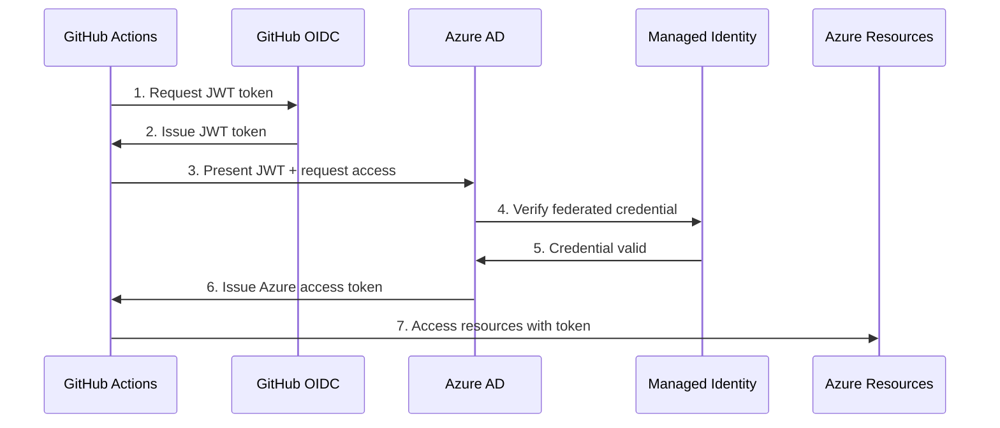

# Konfiguracja Uwierzytelniania GitHub z Azure (Managed Identity)

## Wymagania

- Konto w Azure z aktywną subskrypcją
- Repozytorium GitHub (fork tego projektu)
- Zainstalowane [Azure CLI](https://learn.microsoft.com/en-us/cli/azure/install-azure-cli)
- Wdrożona infrastruktura z Resource Group (z [README-infra.md](README-infra.md))

## Cel

Celem jest skonfigurowanie bezpiecznego uwierzytelniania między GitHub Actions a Azure przy użyciu **User-Assigned Managed Identity** z federated credentials (OIDC).

Ta metoda:
- Eliminuje potrzebę przechowywania sekretów (haseł) w GitHub
- Jest zarządzana jako zwykły zasób Azure (widoczna w resource group)
- Nie wymaga uprawnień do Azure AD
- Automatycznie rotuje tokeny
- Zgodna z Zero Trust security

## Krok 0 - Przygotowanie

Uruchom Cloud Shell w Azure Portal lub zaloguj się lokalnie do Azure CLI:

```bash
az login

# Wyświetl dostępne subskrypcje
az account list --output table

# Ustaw aktywną subskrypcję
az account set --subscription "<SUBSCRIPTION_ID>"

# Pobierz i zapisz ważne wartości
SUBSCRIPTION_ID=$(az account show --query id -o tsv)
TENANT_ID=$(az account show --query tenantId -o tsv)

echo "Subscription ID: $SUBSCRIPTION_ID"
echo "Tenant ID: $TENANT_ID"
```

## Krok 1 - Utwórz User-Assigned Managed Identity

1. Ustaw zmienne dla swojego projektu:

```bash
# Dostosuj do swojego projektu
RESOURCE_GROUP="myproject-dev-rg"
LOCATION="westeurope"
IDENTITY_NAME="github-actions-identity"
```

2. Utwórz managed identity:

```bash
az identity create \
  --name $IDENTITY_NAME \
  --resource-group $RESOURCE_GROUP \
  --location $LOCATION
```

3. Pobierz identyfikatory (zapisz je!):

```bash
# Client ID - będzie używany w GitHub secrets
CLIENT_ID=$(az identity show \
  --name $IDENTITY_NAME \
  --resource-group $RESOURCE_GROUP \
  --query clientId -o tsv)

# Principal ID - do przypisywania ról
PRINCIPAL_ID=$(az identity show \
  --name $IDENTITY_NAME \
  --resource-group $RESOURCE_GROUP \
  --query principalId -o tsv)

echo "Client ID: $CLIENT_ID"
echo "Principal ID: $PRINCIPAL_ID"
```

## Krok 2 - Skonfiguruj Federated Credentials

Federated credentials łączą GitHub Actions z Azure Managed Identity bez użycia sekretów.

1. Ustaw dane swojego repozytorium GitHub:

```bash
# Zmień na swoją nazwę użytkownika i repozytorium
GITHUB_ORG="your-username"
GITHUB_REPO="basiccicd"
```

2. Utwórz federated credential dla gałęzi `main`:

```bash
az identity federated-credential create \
  --name "github-main-branch" \
  --identity-name $IDENTITY_NAME \
  --resource-group $RESOURCE_GROUP \
  --issuer "https://token.actions.githubusercontent.com" \
  --subject "repo:$GITHUB_ORG/$GITHUB_REPO:ref:refs/heads/main" \
  --audiences "api://AzureADTokenExchange"
```

   **Alternatywnie:** Aby zezwolić na **wszystkie gałęzie**, użyj wildcarda:

```bash
az identity federated-credential create \
  --name "github-all-branches" \
  --identity-name $IDENTITY_NAME \
  --resource-group $RESOURCE_GROUP \
  --issuer "https://token.actions.githubusercontent.com" \
  --subject "repo:$GITHUB_ORG/$GITHUB_REPO:ref:refs/heads/*" \
  --audiences "api://AzureADTokenExchange"
```

3. (Opcjonalnie) Dodaj credential dla Pull Requests:

```bash
az identity federated-credential create \
  --name "github-pull-requests" \
  --identity-name $IDENTITY_NAME \
  --resource-group $RESOURCE_GROUP \
  --issuer "https://token.actions.githubusercontent.com" \
  --subject "repo:$GITHUB_ORG/$GITHUB_REPO:pull_request" \
  --audiences "api://AzureADTokenExchange"
```

4. (Opcjonalnie) Dodaj credential dla environment (np. production):

```bash
az identity federated-credential create \
  --name "github-production-env" \
  --identity-name $IDENTITY_NAME \
  --resource-group $RESOURCE_GROUP \
  --issuer "https://token.actions.githubusercontent.com" \
  --subject "repo:$GITHUB_ORG/$GITHUB_REPO:environment:production" \
  --audiences "api://AzureADTokenExchange"
```

## Krok 3 - Przydziel Uprawnienia w Azure

Managed Identity potrzebuje uprawnień do zasobów Azure. Przydziel **tylko** minimalne wymagane uprawnienia.

### Dla Container Registry (push obrazów):

```bash
ACR_NAME="myprojectdevacr"

az role assignment create \
  --role "AcrPush" \
  --assignee-object-id $PRINCIPAL_ID \
  --assignee-principal-type ServicePrincipal \
  --scope "/subscriptions/$SUBSCRIPTION_ID/resourceGroups/$RESOURCE_GROUP/providers/Microsoft.ContainerRegistry/registries/$ACR_NAME"
```

### Dla Web App (deployment):

```bash
WEBAPP_NAME="myproject-dev-app"

az role assignment create \
  --role "Website Contributor" \
  --assignee-object-id $PRINCIPAL_ID \
  --assignee-principal-type ServicePrincipal \
  --scope "/subscriptions/$SUBSCRIPTION_ID/resourceGroups/$RESOURCE_GROUP/providers/Microsoft.Web/sites/$WEBAPP_NAME"
```

### Dla Kubernetes/AKS:

```bash
AKS_NAME="myproject-dev-aks"

az role assignment create \
  --role "Azure Kubernetes Service Cluster User Role" \
  --assignee-object-id $PRINCIPAL_ID \
  --assignee-principal-type ServicePrincipal \
  --scope "/subscriptions/$SUBSCRIPTION_ID/resourceGroups/$RESOURCE_GROUP/providers/Microsoft.ContainerService/managedClusters/$AKS_NAME"
```

### Dla Terraform (cała resource group):

```bash
# UWAGA: Daje szerokie uprawnienia - używaj ostrożnie!
az role assignment create \
  --role "Contributor" \
  --assignee-object-id $PRINCIPAL_ID \
  --assignee-principal-type ServicePrincipal \
  --scope "/subscriptions/$SUBSCRIPTION_ID/resourceGroups/$RESOURCE_GROUP"
```

## Krok 4 - Dodaj Sekrety w GitHub

1. Przejdź do swojego repozytorium na GitHub
2. Nawiguj do **Settings → Secrets and variables → Actions**
3. Kliknij **New repository secret** i dodaj:

| Secret Name | Value | Opis |
|-------------|-------|------|
| `AZURE_CLIENT_ID` | `$CLIENT_ID` (z Kroku 1) | Client ID managed identity |
| `AZURE_TENANT_ID` | `$TENANT_ID` (z Kroku 0) | Azure Tenant ID |
| `AZURE_SUBSCRIPTION_ID` | `$SUBSCRIPTION_ID` (z Kroku 0) | Azure Subscription ID |

```bash
# Wyświetl wartości do skopiowania:
echo "AZURE_CLIENT_ID: $CLIENT_ID"
echo "AZURE_TENANT_ID: $TENANT_ID"
echo "AZURE_SUBSCRIPTION_ID: $SUBSCRIPTION_ID"
```

## Krok 5 - Użycie w GitHub Actions

### Podstawowy przykład (test połączenia):

Utwórz plik `.github/workflows/azure-test.yml`:

```yaml
name: Test Azure Authentication

on:
  workflow_dispatch:  # Ręczne uruchomienie

permissions:
  id-token: write  # WYMAGANE dla OIDC
  contents: read

jobs:
  test:
    runs-on: ubuntu-latest
    steps:
      - name: Azure Login
        uses: azure/login@v1
        with:
          client-id: ${{ secrets.AZURE_CLIENT_ID }}
          tenant-id: ${{ secrets.AZURE_TENANT_ID }}
          subscription-id: ${{ secrets.AZURE_SUBSCRIPTION_ID }}

      - name: Test Azure CLI
        run: |
          az account show
          az group list --output table
```

### Przykład: Build i Push do ACR

```yaml
name: Build and Push to ACR

on:
  push:
    branches: [ main ]

permissions:
  id-token: write
  contents: read

jobs:
  build:
    runs-on: ubuntu-latest
    steps:
      - name: Checkout
        uses: actions/checkout@v4

      - name: Azure Login
        uses: azure/login@v1
        with:
          client-id: ${{ secrets.AZURE_CLIENT_ID }}
          tenant-id: ${{ secrets.AZURE_TENANT_ID }}
          subscription-id: ${{ secrets.AZURE_SUBSCRIPTION_ID }}

      - name: Login to ACR
        run: |
          az acr login --name ${{ vars.ACR_NAME }}

      - name: Build and Push
        run: |
          docker build -t ${{ vars.ACR_NAME }}.azurecr.io/weather-app:${{ github.sha }} .
          docker push ${{ vars.ACR_NAME }}.azurecr.io/weather-app:${{ github.sha }}
```

### Przykład: Deployment do Web App

```yaml
name: Deploy to Azure Web App

on:
  push:
    branches: [ main ]

permissions:
  id-token: write
  contents: read

jobs:
  deploy:
    runs-on: ubuntu-latest
    steps:
      - name: Checkout
        uses: actions/checkout@v4

      - name: Azure Login
        uses: azure/login@v1
        with:
          client-id: ${{ secrets.AZURE_CLIENT_ID }}
          tenant-id: ${{ secrets.AZURE_TENANT_ID }}
          subscription-id: ${{ secrets.AZURE_SUBSCRIPTION_ID }}

      - name: Deploy to Web App
        uses: azure/webapps-deploy@v2
        with:
          app-name: ${{ vars.WEBAPP_NAME }}
          images: ${{ vars.ACR_NAME }}.azurecr.io/weather-app:${{ github.sha }}
```

## Weryfikacja

Sprawdź poprawność konfiguracji:

```bash
# 1. Sprawdź federated credentials
az identity federated-credential list \
  --identity-name $IDENTITY_NAME \
  --resource-group $RESOURCE_GROUP \
  --output table

# 2. Sprawdź przypisane role
az role assignment list \
  --assignee $PRINCIPAL_ID \
  --output table

# 3. Test w GitHub Actions
# Utwórz pusty commit i push
git commit --allow-empty -m "Test Azure authentication"
git push origin main
# Sprawdź Actions w GitHub UI
```

## Struktura Uwierzytelniania (OIDC Flow)



## Najczęstsze problemy

### 1. "AADSTS70021: No matching federated identity record found"

**Przyczyna:** Subject w federated credential nie pasuje do workflow.

**Rozwiązanie:**
```bash
# Sprawdź credentials
az identity federated-credential list \
  --identity-name $IDENTITY_NAME \
  --resource-group $RESOURCE_GROUP

# Upewnij się że subject ma format:
# Main branch: repo:USERNAME/REPO:ref:refs/heads/main
# Pull Request: repo:USERNAME/REPO:pull_request
# Environment: repo:USERNAME/REPO:environment:ENV_NAME
```

### 2. "AuthorizationFailed" podczas operacji

**Przyczyna:** Brak uprawnień managed identity.

**Rozwiązanie:**
```bash
# Sprawdź role
az role assignment list --assignee $PRINCIPAL_ID --output table

# Dodaj brakującą rolę (przykład dla ACR)
az role assignment create \
  --role "AcrPush" \
  --assignee-object-id $PRINCIPAL_ID \
  --assignee-principal-type ServicePrincipal \
  --scope "/subscriptions/$SUBSCRIPTION_ID/resourceGroups/$RESOURCE_GROUP/providers/Microsoft.ContainerRegistry/registries/$ACR_NAME"
```

### 3. Workflow: "Error: Unable to get ACTIONS_ID_TOKEN_REQUEST_URL env variable"

**Przyczyna:** Brak `permissions: id-token: write` w workflow.

**Rozwiązanie:**
```yaml
permissions:
  id-token: write
  contents: read
```

### 4. Managed Identity nie widoczna w Portal

**Przyczyna:** Szukasz w złej resource group lub region.

**Rozwiązanie:**
```bash
# Lista wszystkich managed identities w subskrypcji
az identity list --output table

# Sprawdź konkretną identity
az identity show \
  --name $IDENTITY_NAME \
  --resource-group $RESOURCE_GROUP
```

## Czyszczenie zasobów

Aby usunąć skonfigurowane zasoby:

```bash
# 1. Usuń federated credentials
az identity federated-credential delete \
  --name "github-main-branch" \
  --identity-name $IDENTITY_NAME \
  --resource-group $RESOURCE_GROUP

# 2. Usuń role assignments
az role assignment delete \
  --assignee $PRINCIPAL_ID \
  --scope "/subscriptions/$SUBSCRIPTION_ID/resourceGroups/$RESOURCE_GROUP"

# 3. Usuń managed identity
az identity delete \
  --name $IDENTITY_NAME \
  --resource-group $RESOURCE_GROUP

# 4. Usuń sekrety z GitHub (ręcznie przez UI)
```

## Najlepsze praktyki

1. **Minimalne uprawnienia:** Przydzielaj tylko niezbędne role (np. `AcrPush` zamiast `Contributor`)
2. **Scope na zasobie:** Unikaj uprawnień na poziomie subskrypcji lub resource group
3. **GitHub Environments:** Używaj environments dla różnych środowisk (dev/prod)
4. **Environment Protection:** Skonfiguruj approvals dla production deployments
5. **Audit logs:** Regularnie sprawdzaj logi dostępu w Azure Monitor

## Dokumentacja

- [Microsoft: Connect from Azure using OpenID Connect](https://learn.microsoft.com/en-us/azure/developer/github/connect-from-azure-openid-connect)
- [Microsoft: User-assigned managed identities](https://learn.microsoft.com/en-us/azure/active-directory/managed-identities-azure-resources/how-manage-user-assigned-managed-identities)
- [GitHub: Security hardening with OpenID Connect](https://docs.github.com/en/actions/deployment/security-hardening-your-deployments/about-security-hardening-with-openid-connect)
- [Azure Login Action](https://github.com/Azure/login)

## Powiązane README

- [README-infra.md](README-infra.md) - Wdrażanie infrastruktury Azure
- [README-artefakty-ACR.md](README-artefakty-ACR.md) - Budowanie i publikowanie obrazów do ACR
- [README-deployment-webapp.md](README-deployment-webapp.md) - Deployment do Azure Web App
- [README-gitops.md](README-gitops.md) - GitOps i automatyzacja Terraform
