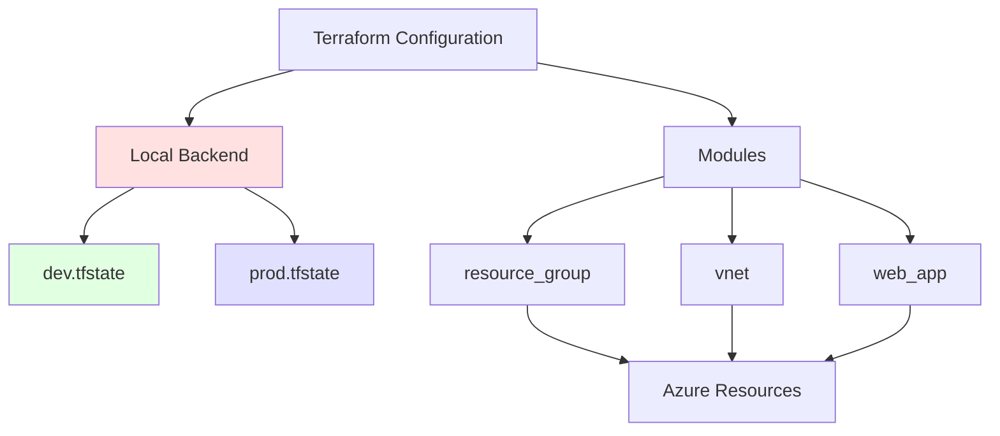

# Infrastruktura z Local Backend State Management

## Przegląd

Ten projekt zawiera konfigurację Terraform do wdrażania infrastruktury Azure z wykorzystaniem **local backend** do przechowywania stanu. Pokazuje dwa podejścia do zarządzania wieloma środowiskami: **Osobne pliki stanu** (dev.tfstate, prod.tfstate).

## Zasoby

Projekt tworzy następujące zasoby Azure:
- **Resource Group** - logiczny kontener dla zasobów
- **Virtual Network** - sieć wirtualna z trzema podsieciami:
  - subnet-app (10.0.0.0/24) - dla aplikacji
  - subnet-data (10.0.1.0/24) - dla danych
  - subnet-integration (10.0.2.0/24) - dla integracji Web App
- **App Service Plan** - plan hostingowy (Basic SKU B1)
- **Web App** - aplikacja webowa z Node.js 22 LTS
  - HTTPS only
  - VNet integration włączona

## Architektura



## Co to jest Terraform Backend?

**Backend** określa gdzie Terraform przechowuje plik stanu (state file). Stan zawiera mapowanie między konfiguracją a rzeczywistymi zasobami w chmurze.

### Local Backend
- Przechowuje stan na **lokalnym dysku**
- **Zalety:**
  - Prosty setup, bez dodatkowej infrastruktury
  - Dobry do nauki i testowania
  - Szybki dostęp do stanu
  
- **Wady:**
  - Brak współdzielenia stanu między członkami zespołu
  - Brak state locking (ryzyko konfliktów)
  - Brak historii zmian
  - Ryzyko utraty przy awarii dysku

### Kiedy używać Local Backend?
✅ Nauka Terraform  
✅ Osobiste projekty testowe  
✅ Proof of concept  
✅ Single-developer projekty  

❌ Production workloads  
❌ Praca zespołowa  
❌ CI/CD pipelines  

## Wymagania

- Konto Azure z aktywną subskrypcją
- [Terraform](https://developer.hashicorp.com/terraform/downloads) >= 1.0
- [Azure CLI](https://learn.microsoft.com/en-us/cli/azure/install-azure-cli)

## Cel

Celem tego ćwiczenia jest zrozumienie zarządzania stanem Terraform (state management) z wykorzystaniem local backend. Poznasz:
- Różnicę między local a remote backend
- Dwa podejścia do zarządzania wieloma środowiskami:
  - Osobne pliki stanu (dev.tfstate, prod.tfstate)
  - Terraform Workspaces (zalecane)
- Kiedy używać local backend, a kiedy przejść na remote backend
- Best practices dla backup i bezpieczeństwa plików stanu

Infrastruktura zawiera:
- Resource Group
- Virtual Network z trzema podsieciami (app, data, integration)
- App Service Plan (Basic SKU)
- Web App z Node.js 22 LTS i VNet integration

## Struktura Katalogów

```
infra_cicd_backend/
├── modules/              # Moduły Terraform
│   ├── resource_group/
│   ├── vnet/
│   └── web_app/
├── main.tf              # Główna konfiguracja
├── providers.tf         # Konfiguracja providerów
├── backend.tf           # Konfiguracja backend
├── variables.tf         # Definicje zmiennych
├── outputs.tf           # Definicje outputów
└── terraform.tfvars.example  # Przykładowa konfiguracja
```

## Podejście 1: Osobne Pliki Stanu

### Konfiguracja

backend.tf dla dev:
```hcl
terraform {
  backend "local" {
    path = "dev.tfstate"
  }
}
```

backend.tf dla prod:
```hcl
terraform {
  backend "local" {
    path = "prod.tfstate"
  }
}
```

### Wdrożenie Dev Environment

```bash
cd infra_cicd_backend

# Upewnij się, że backend.tf używa dev.tfstate
cat backend.tf

# Skopiuj przykładową konfigurację
cp terraform.tfvars.example terraform.tfvars

# Edytuj konfigurację
nano terraform.tfvars
```

Ustaw w terraform.tfvars:
```hcl
subscription_id = "<TWOJE_SUBSCRIPTION_ID>"
project_name    = "webapp"
environment     = "dev"
location        = "westeurope"
owner           = "twoj-zespol"
```

```bash
# Inicjalizacja
terraform init

# Plan
terraform plan

# Wdróż
terraform apply
```

### Wdrożenie Prod Environment

```bash
# Zmień backend.tf na prod.tfstate
sed -i '' 's/dev.tfstate/prod.tfstate/g' backend.tf

# Lub edytuj ręcznie backend.tf:
nano backend.tf

# Zaktualizuj terraform.tfvars
nano terraform.tfvars
# Zmień: environment = "prod"

# Reinicjalizacja z nowym backendem
terraform init -reconfigure

# Wdróż prod
terraform plan
terraform apply
```

### Plusy i Minusy

**✅ Plusy:**
- Proste do zrozumienia
- Wyraźne rozdzielenie środowisk
- Łatwe backupy (kopiuj pliki .tfstate)

**❌ Minusy:**
- Trzeba ręcznie zmieniać backend.tf
- Łatwo popełnić błąd (wdrożyć do złego środowiska)
- Trudniejsze w automatyzacji

## Podejście 2: Terraform Workspaces (ZALECANE)

### Co to są Workspaces?

Workspaces pozwalają na zarządzanie wieloma stanami w tej samej konfiguracji. Każdy workspace ma swój plik stanu.

### Konfiguracja

backend.tf (prostsza wersja):
```hcl
terraform {
  backend "local" {}
}
```

Terraform automatycznie utworzy:
- `terraform.tfstate` (default workspace)
- `terraform.tfstate.d/dev/terraform.tfstate`
- `terraform.tfstate.d/prod/terraform.tfstate`

### Podstawowe Komendy Workspace

```bash
# Lista workspace
terraform workspace list

# Pokaż aktualny workspace
terraform workspace show

# Utwórz nowy workspace
terraform workspace new dev
terraform workspace new prod

# Przełącz workspace
terraform workspace select dev
terraform workspace select prod

# Usuń workspace (tylko jeśli pusty)
terraform workspace delete test
```

### Wdrożenie z Workspaces

#### Krok 1: Setup

```bash
cd infra_cicd_backend

# Skopiuj konfigurację
cp terraform.tfvars.example terraform.tfvars

# Edytuj terraform.tfvars
nano terraform.tfvars
```

#### Krok 2: Dev Environment

```bash
# Inicjalizacja
terraform init

# Utwórz i przełącz na workspace dev
terraform workspace new dev

# Sprawdź czy jesteś w dev
terraform workspace show  # powinno zwrócić: dev

# Edytuj terraform.tfvars
# environment = "dev"

# Wdróż
terraform plan
terraform apply
```

#### Krok 3: Prod Environment

```bash
# Utwórz i przełącz na workspace prod
terraform workspace new prod

# Sprawdź workspace
terraform workspace show  # powinno zwrócić: prod

# Edytuj terraform.tfvars
# environment = "prod"

# Wdróż
terraform plan
terraform apply
```

#### Krok 4: Przełączanie między środowiskami

```bash
# Pracuj z dev
terraform workspace select dev
terraform plan
terraform apply

# Przełącz na prod
terraform workspace select prod
terraform plan
terraform apply

# Lista wszystkich workspace
terraform workspace list
```

### Plusy i Minusy Workspaces

**✅ Plusy:**
- Łatwe przełączanie między środowiskami
- Jeden backend.tf dla wszystkich środowisk
- Mniej podatne na błędy
- Łatwiejsze w automatyzacji
- Stan jest automatycznie oddzielony

**❌ Minusy:**
- Trzeba pamiętać o przełączaniu workspace
- Można przypadkowo wdrożyć do złego workspace
- Wymaga dyscypliny w sprawdzaniu `workspace show`

## Best Practices dla Workspaces

### 1. Zawsze sprawdzaj aktualny workspace

```bash
# Przed każdym terraform apply!
terraform workspace show

# Lub dodaj do outputów
output "current_workspace" {
  value = terraform.workspace
}
```

### 2. Używaj zmiennych środowiskowych

```bash
# .envrc lub .bashrc
export TF_WORKSPACE=dev

# Terraform automatycznie użyje tego workspace
terraform plan
```

### 3. Koloruj prompt w terminal

```bash
# W .bashrc lub .zshrc
parse_tf_workspace() {
  if [ -d .terraform ]; then
    terraform workspace show 2>/dev/null
  fi
}

PS1='[\u@\h \W $(parse_tf_workspace)]$ '
```

### 4. Używaj różnych wartości dla environment

```bash
# terraform.tfvars dla dev workspace
environment = "dev"
location    = "westeurope"

# terraform.tfvars dla prod workspace  
environment = "prod"
location    = "northeurope"
```

Albo lepiej, użyj różnych plików:

```bash
# terraform.tfvars.dev
environment = "dev"

# terraform.tfvars.prod
environment = "prod"

# Użycie:
terraform workspace select dev
terraform apply -var-file="terraform.tfvars.dev"

terraform workspace select prod
terraform apply -var-file="terraform.tfvars.prod"
```

## Weryfikacja Stanu

### Sprawdź pliki stanu

```bash
# Podejście 1: Osobne pliki
ls -la *.tfstate
# Powinieneś zobaczyć: dev.tfstate, prod.tfstate

# Podejście 2: Workspaces
ls -la terraform.tfstate.d/
# Powinieneś zobaczyć katalogi: dev/, prod/

ls -la terraform.tfstate.d/dev/
ls -la terraform.tfstate.d/prod/
```

### Sprawdź zasoby w stanie

```bash
# Lista zasobów
terraform state list

# Szczegóły zasobu
terraform state show azurerm_resource_group.this

# Wyświetl outputy
terraform output
```

## Backup State Files

**WAŻNE:** Lokalny backend nie tworzy automatycznych backupów!

### Ręczny backup

```bash
# Backup dev environment
cp dev.tfstate dev.tfstate.backup.$(date +%Y%m%d_%H%M%S)

# Lub dla workspaces
cp terraform.tfstate.d/dev/terraform.tfstate \
   terraform.tfstate.d/dev/terraform.tfstate.backup.$(date +%Y%m%d_%H%M%S)
```

### Skrypt automatycznego backupu

Utwórz `backup-state.sh`:

```bash
#!/bin/bash

BACKUP_DIR="./state-backups"
TIMESTAMP=$(date +%Y%m%d_%H%M%S)

mkdir -p $BACKUP_DIR

# Backup workspaces
if [ -d "terraform.tfstate.d" ]; then
    for workspace in terraform.tfstate.d/*/; do
        ws_name=$(basename $workspace)
        cp terraform.tfstate.d/$ws_name/terraform.tfstate \
           $BACKUP_DIR/terraform.tfstate.$ws_name.$TIMESTAMP
        echo "Backed up $ws_name workspace"
    done
fi

# Backup separate state files
for statefile in *.tfstate; do
    if [ -f "$statefile" ]; then
        cp $statefile $BACKUP_DIR/$statefile.$TIMESTAMP
        echo "Backed up $statefile"
    fi
done

# Keep only last 10 backups
ls -t $BACKUP_DIR/* | tail -n +11 | xargs rm -f

echo "Backup completed: $BACKUP_DIR"
```

Użycie:
```bash
chmod +x backup-state.sh
./backup-state.sh
```

### Git ignore dla state files

Utwórz `.gitignore`:

```gitignore
# Terraform files
*.tfstate
*.tfstate.*
.terraform/
.terraform.lock.hcl

# Backups
state-backups/

# Variable files with secrets
terraform.tfvars
*.auto.tfvars

# Crash logs
crash.log
```

**NIGDY nie commituj plików .tfstate do git!** Zawierają wrażliwe dane.

## Migracja na Remote Backend

Gdy projekt dojrzeje, warto przenieść się na remote backend.

### Setup Azure Storage Backend

```bash
# Zmienne
RG_NAME="rg-terraform-state"
STORAGE_NAME="sttfstate$(openssl rand -hex 4)"
CONTAINER_NAME="tfstate"
LOCATION="westeurope"

# Utwórz resource group
az group create --name $RG_NAME --location $LOCATION

# Utwórz storage account
az storage account create \
  --name $STORAGE_NAME \
  --resource-group $RG_NAME \
  --location $LOCATION \
  --sku Standard_LRS \
  --encryption-services blob \
  --allow-blob-public-access false

# Utwórz container
az storage container create \
  --name $CONTAINER_NAME \
  --account-name $STORAGE_NAME

# Pokaż access key
az storage account keys list \
  --resource-group $RG_NAME \
  --account-name $STORAGE_NAME \
  --query '[0].value' -o tsv
```

### Zaktualizuj backend.tf

```hcl
terraform {
  backend "azurerm" {
    resource_group_name  = "rg-terraform-state"
    storage_account_name = "sttfstateXXXXXXXX"  # Twoja nazwa
    container_name       = "tfstate"
    key                  = "webapp-dev.tfstate"  # dev environment
  }
}
```

### Migruj stan

```bash
# Terraform automatycznie zapyta o migrację
terraform init

# Potwierdź migrację
# yes

# Zweryfikuj
terraform state list
```

## Czyszczenie Zasobów

### Niszczenie środowiska

**Podejście 1: Osobne pliki**

```bash
# Usuń dev
# Upewnij się, że backend.tf używa dev.tfstate
terraform destroy

# Usuń prod
# Zmień backend.tf na prod.tfstate
terraform init -reconfigure
terraform destroy
```

**Podejście 2: Workspaces**

```bash
# Usuń dev
terraform workspace select dev
terraform destroy

# Usuń prod
terraform workspace select prod
terraform destroy

# Usuń workspace (po destroy!)
terraform workspace select default
terraform workspace delete dev
terraform workspace delete prod
```

### Czyszczenie plików lokalnych

```bash
# Usuń state files
rm -f *.tfstate*
rm -rf terraform.tfstate.d/

# Usuń terraform cache
rm -rf .terraform/
rm -f .terraform.lock.hcl

# Usuń backupy
rm -rf state-backups/
```

## Porównanie: Separate Files vs Workspaces

| Aspekt | Separate Files | Workspaces |
|--------|---------------|------------|
| **Setup** | Zmiana backend.tf | `workspace new` |
| **Przełączanie** | `init -reconfigure` | `workspace select` |
| **Pliki** | dev.tfstate, prod.tfstate | terraform.tfstate.d/* |
| **Błędy** | Łatwo wdrożyć do złego env | Trzeba pamiętać workspace |
| **Automatyzacja** | Trudniejsza | Łatwiejsza |
| **Zalecenie** | ❌ Nie dla production | ✅ Lepsze rozwiązanie |

## Najczęstsze Problemy

### 1. Wdrożenie do złego workspace

**Problem:** Przypadkowe `terraform apply` w prod workspace

**Rozwiązanie:**
```bash
# Zawsze sprawdzaj przed apply!
terraform workspace show

# Dodaj safeguard
alias tfapply='echo "Current workspace: $(terraform workspace show)" && terraform apply'
```

### 2. Utrata pliku stanu

**Problem:** Przypadkowe usunięcie .tfstate

**Rozwiązanie:**
```bash
# Przywróć z backupu
cp state-backups/terraform.tfstate.dev.20260103_120000 dev.tfstate

# Jeśli brak backupu, import zasobów ręcznie
terraform import azurerm_resource_group.this /subscriptions/.../resourceGroups/rg-name
```

### 3. Konflikt stanu

**Problem:** Stan nie zgadza się z rzeczywistością

**Rozwiązanie:**
```bash
# Odśwież stan
terraform refresh

# Lub usuń zasób ze stanu (nie usuwa z Azure!)
terraform state rm azurerm_resource_group.this

# Reimport
terraform import azurerm_resource_group.this <resource-id>
```

### 4. Workspace nie istnieje

**Problem:** `Workspace "dev" doesn't exist`

**Rozwiązanie:**
```bash
# Utwórz workspace
terraform workspace new dev

# Lub przełącz na istniejący
terraform workspace list
terraform workspace select dev
```

## Koszty

Identyczne jak w [README-infra-split.md](../infra_cicd_split/README-infra-split.md):

- **App Service Plan B1:** ~13 EUR/miesiąc
- **VNet:** Darmowy
- **Local Backend:** Darmowy (żadnych dodatkowych kosztów Azure)

## Następne Kroki

### 1. Remote Backend dla Production

Zobacz sekcję "Migracja na Remote Backend" powyżej lub:
- [README-gitops.md](../README-gitops.md) - Automated Terraform with GitHub Actions

### 2. State Locking

Remote backend (Azure Storage) oferuje:
- **State locking** - zapobiega konfliktom
- **Encryption** - bezpieczne przechowywanie
- **Versioning** - historia zmian
- **Team collaboration** - współdzielenie stanu

### 3. Terraform Cloud

Rozważ [Terraform Cloud](https://app.terraform.io) dla:
- Managed remote state
- UI dla state management
- Cost estimation
- Policy as Code
- Team permissions

## Dokumentacja

- [Terraform Backends](https://developer.hashicorp.com/terraform/language/settings/backends/configuration)
- [Local Backend](https://developer.hashicorp.com/terraform/language/settings/backends/local)
- [Workspaces](https://developer.hashicorp.com/terraform/language/state/workspaces)
- [State Management](https://developer.hashicorp.com/terraform/language/state)
- [Azure Backend](https://developer.hashicorp.com/terraform/language/settings/backends/azurerm)

## Powiązane README

- [README-infra.md](../README-infra.md) - Główny dokument o infrastrukturze
- [README-infra-split.md](../infra_cicd_split/README-infra-split.md) - Multi-environment setup
- [README-gitops.md](../README-gitops.md) - GitOps i remote backend
- [README-deployment-webapp.md](../README-deployment-webapp.md) - Deployment aplikacji
