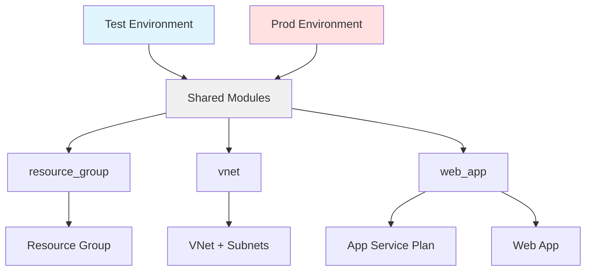

# Infrastruktura Multi-Environment (Test/Prod)

## Przegląd

Ten projekt zawiera konfigurację Terraform do wdrażania infrastruktury Azure w wielu środowiskach (test i prod) z wykorzystaniem wspólnych modułów. Każde środowisko ma identyczną konfigurację, ale jest zarządzane osobnym stanem Terraform.

## Zasoby

Projekt tworzy następujące zasoby Azure:
- **Resource Group** - logiczny kontener dla zasobów
- **Virtual Network** - sieć wirtualna z trzema podsieciami:
  - subnet-app (10.x.0.0/24) - dla aplikacji
  - subnet-data (10.x.1.0/24) - dla danych
  - subnet-integration (10.x.2.0/24) - dla integracji Web App
- **App Service Plan** - plan hostingowy (Basic SKU B1)
- **Web App** - aplikacja webowa z Node.js 22 LTS
  - HTTPS only
  - VNet integration włączona

## Architektura



## Wymagania

- Konto Azure z aktywną subskrypcją
- [Terraform](https://developer.hashicorp.com/terraform/downloads) >= 1.0
- [Azure CLI](https://learn.microsoft.com/en-us/cli/azure/install-azure-cli)

## Cel

Celem tego ćwiczenia jest nauczenie się zarządzania wieloma środowiskami (test/prod) przy użyciu Terraform z wykorzystaniem wspólnych modułów. Każde środowisko:
- Ma identyczną konfigurację infrastruktury
- Jest zarządzane osobnym stanem Terraform
- Wykorzystuje te same moduły, co zapewnia spójność
- Ma własny plik konfiguracyjny (terraform.tfvars)

Infrastruktura zawiera:
- Resource Group
- Virtual Network z trzema podsieciami (app, data, integration)
- App Service Plan (Basic SKU)
- Web App z Node.js 22 LTS i VNet integration

## Struktura Katalogów

```
infra_cicd_split/
├── modules/              # Wspólne moduły
│   ├── resource_group/
│   ├── vnet/
│   └── web_app/
├── test/                 # Środowisko testowe
│   ├── main.tf
│   ├── providers.tf
│   ├── variables.tf
│   ├── outputs.tf
│   └── terraform.tfvars.example
└── prod/                 # Środowisko produkcyjne
    ├── main.tf
    ├── providers.tf
    ├── variables.tf
    ├── outputs.tf
    └── terraform.tfvars.example
```

## Konwencja Nazewnicza (CAF)

Projekt wykorzystuje Microsoft Cloud Adoption Framework (CAF) naming convention:

- Resource Group: `rg-<project>-<environment>-<random>`
- VNet: `vnet-<project>-<environment>-<random>`
- App Service Plan: `plan-<project>-<environment>-<random>`
- Web App: `app-<project>-<environment>-<random>`

Random suffix (4 znaki) zapewnia unikalność nazw bez dodatkowej konfiguracji.

## Krok 1 - Uruchom Cloud Shell w Azure i sklonuj kod ćwiczeń

Nawiguj w przeglądarce do [portal.azure.com](https://portal.azure.com), uruchom "Cloud Shell" i wybierz `Bash`.

Oficjalna dokumentacja: [Cloud Shell Quickstart](https://github.com/MicrosoftDocs/azure-docs/blob/main/articles/cloud-shell/quickstart.md).

```bash
git clone https://github.com/wguzik/basicicd.git
```

> Poniższe kroki realizuje się za pomocą Cloud Shell.

Podstawowym narzędziem do edycji kodu jest wbudowany w `VS Code` w Cloud Shell, który można uruchomić za pomocą polecenia `code`.

Zaloguj się do Azure CLI:

```bash
az login
```

### Sprawdzenie ID subskrypcji

```bash
az account show --query id -o tsv
```

## Krok 2: Wdrożenie Środowiska Test

### 2.1 Przejdź do katalogu test

```bash
cd infra_cicd_split/test
```

### 2.2 Utwórz plik konfiguracyjny

```bash
cp terraform.tfvars.example terraform.tfvars
```

### 2.3 Edytuj terraform.tfvars

```bash
# Możesz użyć dowolnego edytora
code terraform.tfvars
# lub
nano terraform.tfvars
```

Wypełnij wartości:

```hcl
subscription_id = "<TWOJE_SUBSCRIPTION_ID>"
project_name    = "webapp"
environment     = "test"
location        = "westeurope"
owner           = "twoj-zespol"
```

### 2.4 Inicjalizacja Terraform

```bash
terraform init
```

### 2.5 Przegląd zmian

```bash
terraform plan
```

### 2.6 Wdrożenie infrastruktury

```bash
terraform apply
```

Wpisz `yes` aby potwierdzić.

### 2.7 Sprawdź outputy

Po zakończeniu wdrożenia zobaczysz informacje o utworzonych zasobach:

```bash
terraform output
```

Przykładowy output:
```
web_app_url = "https://app-webapp-test-a1b2.azurewebsites.net"
resource_group_name = "rg-webapp-test-a1b2"
```

## Krok 3: Wdrożenie Środowiska Prod

### 3.1 Przejdź do katalogu prod

```bash
cd ../prod
```

### 3.2 Utwórz plik konfiguracyjny

```bash
cp terraform.tfvars.example terraform.tfvars
```

### 3.3 Edytuj terraform.tfvars

```bash
code terraform.tfvars
```

Wypełnij wartości (użyj tej samej subscription_id):

```hcl
subscription_id = "<TWOJE_SUBSCRIPTION_ID>"
project_name    = "webapp"
environment     = "prod"
location        = "westeurope"
owner           = "twoj-zespol"
```

### 3.4 Wdróż środowisko prod

```bash
terraform init
terraform plan
terraform apply
```

## Weryfikacja Wdrożenia

### Sprawdź zasoby w Azure Portal

1. Zaloguj się do [Azure Portal](https://portal.azure.com)
2. Znajdź resource groups:
   - `rg-webapp-test-xxxx`
   - `rg-webapp-prod-xxxx`

### Test Web App

```bash
# Test environment
curl https://<web-app-test-hostname>

# Prod environment
curl https://<web-app-prod-hostname>
```

### Sprawdź stan Terraform

```bash
# W katalogu test
cd test
terraform state list

# W katalogu prod
cd ../prod
terraform state list
```

## Różnice między Test i Prod

| Aspekt             | Test                   | Prod                   |
| ------------------ | ---------------------- | ---------------------- |
| Adres VNet         | 10.0.0.0/16            | 10.1.0.0/16            |
| Subnet App         | 10.0.0.0/24            | 10.1.0.0/24            |
| Subnet Data        | 10.0.1.0/24            | 10.1.1.0/24            |
| Subnet Integration | 10.0.2.0/24            | 10.1.2.0/24            |
| Environment tag    | test                   | prod                   |
| Stan Terraform     | test/terraform.tfstate | prod/terraform.tfstate |

## Zarządzanie Środowiskami

### Przełączanie między środowiskami

```bash
# Praca w środowisku test
cd infra_cicd_split/test
terraform plan

# Praca w środowisku prod
cd ../prod
terraform plan
```

### Aktualizacja środowiska

Jeśli chcesz zaktualizować konfigurację:

1. Edytuj pliki w katalogu środowiska
2. Uruchom `terraform plan` aby zobaczyć zmiany
3. Uruchom `terraform apply` aby zastosować

### Niszczenie środowiska

**UWAGA:** To usunie wszystkie zasoby!

```bash
# Usuń środowisko test
cd infra_cicd_split/test
terraform destroy

# Usuń środowisko prod
cd ../prod
terraform destroy
```

## Najczęstsze Problemy

### 1. Konflikt nazw zasobów

**Problem:** Nazwa Web App już istnieje  
**Rozwiązanie:** Random suffix powinien zapobiec konfliktom. Jeśli wystąpi, uruchom ponownie `terraform apply` - zostanie wygenerowany nowy suffix.

### 2. Brak uprawnień

**Problem:** Authorization failed  
**Rozwiązanie:**
```bash
# Sprawdź zalogowanego użytkownika
az account show

# Sprawdź uprawnienia
az role assignment list --assignee <your-email>
```

Potrzebujesz roli `Contributor` lub wyższej.

### 3. Limity subskrypcji

**Problem:** Quota exceeded  
**Rozwiązanie:**
```bash
# Sprawdź użycie
az vm list-usage --location westeurope -o table

# Możesz zmienić region w terraform.tfvars
location = "northeurope"
```

### 4. Błąd inicjalizacji Terraform

**Problem:** Terraform init fails  
**Rozwiązanie:**
```bash
# Wyczyść cache
rm -rf .terraform
rm .terraform.lock.hcl

# Zainicjalizuj ponownie
terraform init
```

### 5. Stan Terraform zablokowany

**Problem:** State lock  
**Rozwiązanie:**
```bash
# Wymuszenie odblokowania (ostrożnie!)
terraform force-unlock <LOCK_ID>
```

## Czyszczenie Zasobów

### Opcja 1: Niszczenie wszystkich środowisk

```bash
# Test
cd infra_cicd_split/test
terraform destroy -auto-approve

# Prod
cd ../prod
terraform destroy -auto-approve
```

### Opcja 2: Ręczne usunięcie przez Portal

1. Przejdź do [Azure Portal](https://portal.azure.com)
2. Znajdź resource groups
3. Usuń każdą resource group (to usunie wszystkie zasoby wewnątrz)

## Koszty

Przy użyciu Basic SKU (B1), szacunkowe koszty miesięczne:

- **App Service Plan B1:** ~13 EUR/miesiąc
- **VNet:** Darmowy (chyba że używasz VNet peering/VPN)
- **Web App:** Wliczone w koszt App Service Plan

**Razem na środowisko:** ~13-15 EUR/miesiąc  
**Oba środowiska (test + prod):** ~26-30 EUR/miesiąc

**WAŻNE:** Pamiętaj zniszczyć zasoby po zakończeniu ćwiczeń!

## Następne Kroki

### 1. Deployment aplikacji

Zobacz [README-deployment-webapp.md](../README-deployment-webapp.md) aby dowiedzieć się jak wdrożyć aplikację.

### 2. CI/CD Pipeline

Zobacz [README-ci.md](../README-ci.md) aby skonfigurować automatyczne wdrażanie.

### 3. Remote State

Dla pracy zespołowej rozważ użycie remote backend:
- [README-infra-backend.md](../README-infra-backend.md)
- [README-gitops.md](../README-gitops.md)

### 4. Monitoring

Zobacz [README-infra.md](../README-infra.md) sekcja o Azure Monitor i Application Insights.

## Moduły Terraform

### resource_group

Tworzy Resource Group z odpowiednimi tagami.

**Inputs:**
- `resource_group_name` - nazwa resource group
- `location` - region Azure
- `tags` - tagi do zastosowania

**Outputs:**
- `id` - ID resource group
- `name` - nazwa resource group
- `location` - region

### vnet

Tworzy Virtual Network z podsieciami.

**Inputs:**
- `vnet_name` - nazwa VNet
- `resource_group_name` - nazwa resource group
- `location` - region Azure
- `address_space` - przestrzeń adresowa
- `subnet_config` - konfiguracja podsieci
- `tags` - tagi

**Outputs:**
- `id` - ID VNet
- `name` - nazwa VNet
- `subnet_ids` - mapa podsieci
- `integration_subnet_id` - ID podsieci dla integracji

### web_app

Tworzy App Service Plan i Web App.

**Inputs:**
- `app_service_plan_name` - nazwa planu
- `web_app_name` - nazwa web app
- `resource_group_name` - nazwa resource group
- `location` - region
- `sku_name` - SKU (domyślnie B1)
- `integration_subnet_id` - ID podsieci dla VNet integration
- `tags` - tagi

**Outputs:**
- `app_service_plan_id` - ID planu
- `web_app_id` - ID web app
- `web_app_url` - URL aplikacji
- `web_app_default_hostname` - hostname

## Best Practices

1. **Zawsze używaj terraform plan** przed apply
2. **Nie commituj terraform.tfvars** do repozytorium (zawiera subskrypcję)
3. **Używaj tagów** dla łatwego zarządzania kosztami
4. **Dokumentuj zmiany** w infrastrukturze
5. **Testuj na środowisku test** przed wdrożeniem na prod
6. **Regularnie aktualizuj** wersje provider
7. **Monitoruj koszty** w Azure Cost Management

## Dokumentacja

- [Terraform Azure Provider](https://registry.terraform.io/providers/hashicorp/azurerm/latest/docs)
- [Azure CLI](https://learn.microsoft.com/en-us/cli/azure/)
- [Azure App Service](https://learn.microsoft.com/en-us/azure/app-service/)
- [Azure Virtual Networks](https://learn.microsoft.com/en-us/azure/virtual-network/)
- [CAF Naming Convention](https://learn.microsoft.com/en-us/azure/cloud-adoption-framework/ready/azure-best-practices/resource-naming)

## Powiązane README

- [README-infra.md](../README-infra.md) - Główny dokument o infrastrukturze
- [README-infra-backend.md](../README-infra-backend.md) - Backend state configuration
- [README-deployment-webapp.md](../README-deployment-webapp.md) - Deployment aplikacji
- [README-ci.md](../README-ci.md) - CI/CD Pipeline
- [README-gitops.md](../README-gitops.md) - GitOps workflow
