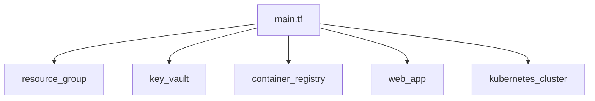

# Infrastruktura w Azure

## Wymagania

- Konto w Azure z aktywną subskrypcją
- Zainstalowany [Terraform](https://developer.hashicorp.com/terraform/downloads)
- Zainstalowane [Azure CLI](https://learn.microsoft.com/en-us/cli/azure/install-azure-cli)

## Cel

Celem jest zbudowanie kompletnej infrastruktury w Azure, która zawiera:
- Resource Group
- Virtual Network z podsieciami
- Key Vault
- Container Registry
- Web App
- Klaster Kubernetes (AKS)
- NGINX Ingress Controller

## Krok 0 - Uruchom Cloud Shell w Azure i sklonuj kod ćwiczeń

Nawiguj w przeglądarce do [portal.azure.com](https://portal.azure.com), uruchom "Cloud Shell" i wybierz `Bash`.

Oficjalna dokumentacja: [Cloud Shell Quickstart](https://github.com/MicrosoftDocs/azure-docs/blob/main/articles/cloud-shell/quickstart.md).

```bash
git clone https://github.com/wguzik/basiccicd.git
```

> Poniższe kroki realizuje się za pomocą Cloud Shell.

Podstawowym narzędziem do edycji kodu jest wbudowany w `VS Code` w Cloud Shell, który można uruchomić za pomocą polecenia `code`.

Jeżeli pracujesz lokalnie, zaloguj się do Azure.

```bash
az login
```

## Krok 1 - Konfiguracja zmiennych

1. Utwórz plik `terraform.tfvars` w katalogu `infra`:

```bash
cd cd basiccicd/infra/
cp terraform.tfvars.example terraform.tfvars
```

```bash
# znajdź ID subskrypcji
az account show
```

Uruchom VS Code w trybie edycji:

```bash
code .
```

Otwórz plik `terraform.tfvars` i uzupełnij zmienne:

```hcl
subscription_id = "<ID_SUBSKRYPCJI>"
project_name    = "myproject"
environment     = "dev"
owner           = "team-name"
location        = "westeurope"
```

## Krok 2 - Inicjalizacja Terraform

Przejdź do katalogu `infra` i zainicjalizuj Terraform:

```bash
terraform init

terraform plan
```

## Krok 3 - Wdrożenie infrastruktury

- Wdróż infrastrukturę:

```bash
terraform apply
```

- Zaloguj się do klastra kubernetes

```bash
# znajdź podobny output po wykonaniu terraforma:

az aks get-credentials --name myproject-dev-aks --resource-group myproject-dev-rg
```

- uruchom `managed nginx`

```
# ten krok można wykonać za pomocą terraforma, ale celowo ustawiasz to ręcznie

az aks approuting enable --resource-group <ResourceGroupName> --name <ClusterName>
```

## Struktura modułów

Infrastruktura jest podzielona na moduły:



## Czyszczenie zasobów

Aby usunąć wszystkie utworzone zasoby:

```bash
terraform destroy
```

## Najczęstsze problemy

1. **Problem z dostępem**: Upewnij się, że masz odpowiednie uprawnienia w subskrypcji Azure.
2. **Konflikt nazw**: Niektóre zasoby wymagają unikalnych nazw w skali globalnej (np. ACR).
3. **Limity zasobów**: Sprawdź czy masz wystarczające limity w subskrypcji.

## Następne Kroki

### Automatyzacja Terraform w Pipeline (Zaawansowane)

W tym module używaliśmy Terraform manualnie. Dla zespołów chcących wdrożyć Infrastructure as Code w pełni zautomatyzowany sposób, zobacz:

- **[README-gitops.md](README-gitops.md)** - część 3 zawiera konfigurację Terraform w GitHub Actions z:
  - Automatycznym `terraform plan` na Pull Requests
  - Automatycznym `terraform apply` po merge do `main`
  - Drift detection - wykrywanie ręcznych zmian w infrastrukturze
  - Remote state w Azure Storage Backend

To podejście zapewnia:
- Code review dla zmian infrastruktury
- Audit trail wszystkich zmian
- Ochronę przed driftem konfiguracji
- Automatyczne wykrywanie konfliktów

## Dokumentacja

- [Terraform Azure Provider](https://registry.terraform.io/providers/hashicorp/azurerm/latest/docs)
- [Azure CLI](https://learn.microsoft.com/en-us/cli/azure/)
- [AKS Documentation](https://learn.microsoft.com/en-us/azure/aks/)
- [Terraform Automation Best Practices](https://developer.hashicorp.com/terraform/tutorials/automation)
